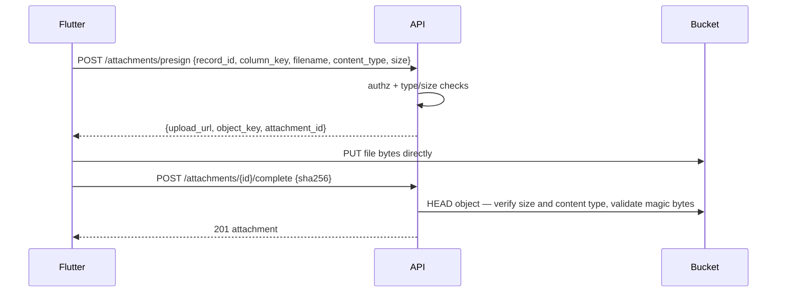

# Velmart — API Reference

**Status:** Hand-authored specification, derived from [PROJECT_PLAN §21](PROJECT_PLAN.md).
**Once the API exists, this document is regenerated from the OpenAPI schema at `/openapi.json`** —
until then it is the contract the implementation must satisfy.

- **Base URL:** `https://<railway-domain>` (no version prefix — every router in `app/main.py` is
  registered unprefixed except `/health`/`/health/ready`, which stay unversioned by convention;
  confirmed against the 425-test backend suite, which hits every path bare)
- **Auth:** `Authorization: Bearer <access_jwt>`
- **Content type:** `application/json` unless noted

---

## 1. Conventions

### 1.1 Idempotency

Creates accept an `Idempotency-Key` header. The key, the endpoint, and a hash of the request body
are stored in `idempotency_keys`; replaying the same key returns the **stored response** rather than
creating a second row. A client may also send a device-generated `client_uuid`, enforced at the
database level by `ux_records_client_uuid`. (This was designed for an offline outbox; offline sync
was cut from scope, but the column and its uniqueness constraint remain and still de-duplicate a
retried create.)

Keys older than 48 hours are removed by the nightly job.

### 1.2 Optimistic locking

Every mutable row carries a `version`. Updates require either an `If-Match: <version>` header or a
`version` field in the body. A mismatch returns **409**.

```
PATCH /records/{id}
If-Match: 3
```

### 1.3 Pagination

Lists are cursor-paginated:

```
GET /pages/{id}/records?cursor=eyJ...&limit=50
```

```json
{ "items": [ ... ], "next_cursor": "eyJ...", "has_more": true }
```

`limit` defaults to 50. Record queries are hard-capped at 500 rows per call.

### 1.4 Errors — RFC 9457 problem details

```json
{
  "type": "https://velmart.app/errors/insufficient-permission",
  "title": "Insufficient permission",
  "status": 403,
  "detail": "Only owners can change a protected field.",
  "code": "PROTECTED_FIELD_FORBIDDEN",
  "request_id": "01J8..."
}
```

| Status | When |
|---|---|
| `400` | Malformed request |
| `401` | Missing / invalid / expired token, or `token_version` bumped |
| `403` | Permission denied — **audited** as `PERMISSION_DENIED` |
| `404` | Not found, **or** not visible to this caller (a manager without a page grant gets 404, not 403 — a page they cannot see should not be confirmed to exist) |
| `409` | Version conflict, expired/stale AI proposal, or a page `key` collision |
| `422` | Validation failure against the page schema |
| `429` | Rate limit exceeded |

Common `code` values: `PROTECTED_FIELD_FORBIDDEN`, `MANAGER_CANNOT_EDIT`, `PAGE_ACCESS_DENIED`,
`VERSION_CONFLICT`, `PROPOSAL_EXPIRED`, `PROPOSAL_STALE`, `VALIDATION_FAILED`, `FORMULA_CYCLE`,
`COLUMN_KEY_IMMUTABLE`, `REFERENCE_NOT_FOUND`, `AI_DISABLED`, `AI_BUDGET_EXCEEDED`,
`RESERVED_PAGE_KEY`, `SYSTEM_PAGE_IMMUTABLE`.

### 1.5 Rate limits

| Scope | Limit |
|---|---|
| Login | 5 / min / IP |
| General API | 100 / min / user |
| AI messages | 20 / 5 min |

### 1.6 Money on the wire

Money is **always a string** (`"35000.00"`), never a JSON number. JSON numbers are widened to
doubles by most parsers, which silently corrupts money.

### 1.7 System pages

Six pages ship with the product — Employee Salary, Purchases, Expenses, Daily Revenue, Cash Ledger
and Cheques — stored in their own native tables rather than in `records`. **They use exactly the
same endpoints as any Owner-created page.** A client or AI tool cannot tell the difference except by
reading `is_system` and `storage_table` on the page.

| Page key | Backing table |
|---|---|
| `employee_salary` | `employee_salaries` |
| `purchases` | `purchases` |
| `expenses` | `expenses` |
| `daily_revenue` | `daily_revenue` |
| `cash_ledger` | `cash_ledger` |
| `cheques` | `cheques` |

Two rules apply only to them:

| Attempt | Result |
|---|---|
| `POST /pages` with a name deriving to a reserved key (including singular/plural variants, so "Cheque" is refused too) | **409 `RESERVED_PAGE_KEY`** |
| `PATCH`/`DELETE` a system page, or add/edit/delete its columns | **409 `SYSTEM_PAGE_IMMUTABLE`** — these schemas change by migration |

**Computed columns are read-only.** `daily_revenue.total_revenue` and `cash_ledger.total_amount` are
database-generated (`cash + card`); supplying either in a write body is rejected. They are always
present in responses.

Database constraints surface as **422 `VALIDATION_FAILED`** from any path — the API or an AI
proposal apply. Every money column on these tables carries `CHECK (>= 0)`.

**`cheques` status:** the protected column is `cheque_status` (`PENDING` | `PAID`), labelled
"Status" in the UI. It is named that because `status` is already the platform record lifecycle
(`ACTIVE`/`REVERSED`/`VOID`) on every table. Managers cannot set it at create time or change it
afterwards — only the Owner, via `PATCH /records/{id}/protected-field`.

### 1.8 Daily reconciliation

The one workflow with a dedicated endpoint, because it spans two tables:

```
GET /reconciliation?from=2026-09-01&to=2026-09-30
```

```json
{ "items": [
    { "business_date": "2026-09-07",
      "revenue_total": "250000.00",
      "ledger_total":  "248000.00",
      "difference":    "2000.00" } ] }
```

```
Difference = Daily Revenue total_revenue − Cash Ledger total_amount
```

A **zero difference means the two totals match**. Dates present in only one of the two tables still
appear, with the missing side as `"0.00"` — an unrecorded cash ledger entry is exactly what
reconciliation exists to surface. All figures are strings carrying `NUMERIC`/`Decimal` values.

Backed by the `daily_reconciliation` view, computed on read so it can never be stale. Owner sees all
dates; a manager sees only what their store scope and page grants allow.

---

## 2. Endpoint summary

`✅` allowed · `🟡` conditional · `❌` 403.

| Method | Path | Owner | Manager |
|---|---|:---:|:---:|
| POST | `/auth/login` | ✅ | ✅ |
| POST | `/auth/refresh` | ✅ | ✅ |
| POST | `/auth/logout` | ✅ | ✅ |
| GET | `/me` | ✅ | ✅ |
| GET | `/users` | ✅ | ❌ |
| POST / PATCH | `/users`, `/users/{id}` | ✅ | ❌ |
| GET | `/stores` | ✅ | 🟡 assigned |
| POST / PATCH | `/stores` | ✅ | ❌ |
| **GET** | `/pages` | ✅ all | 🟡 granted only |
| **POST** | `/pages` | ✅ | **❌** |
| **PATCH / DELETE** | `/pages/{id}` | ✅ | **❌** |
| GET | `/pages/{id}/schema` | ✅ | 🟡 granted |
| **POST** | `/pages/{id}/columns` | ✅ | **❌** |
| **PATCH / DELETE** | `/columns/{id}` | ✅ | **❌** |
| **PUT** | `/pages/{id}/access` | ✅ | **❌** |
| GET | `/pages/{id}/records` | ✅ | 🟡 granted |
| POST | `/pages/{id}/records` | ✅ | 🟡 granted + `can_create` |
| GET | `/records/{id}` | ✅ | 🟡 granted |
| **PATCH** | `/records/{id}` | ✅ | **❌** |
| **DELETE** | `/records/{id}` | ✅ | **❌** |
| **PATCH** | `/records/{id}/protected-field` | ✅ | **❌** |
| POST | `/pages/{id}/records/query` | ✅ | 🟡 granted |
| POST | `/pages/{id}/aggregate` | ✅ | 🟡 granted |
| GET | `/pages/{id}/column-values/{key}` | ✅ | 🟡 granted |
| **POST** | `/pages/{id}/export` | ✅ | **❌** |
| GET | `/dashboard/digest` | ✅ | ✅ |
| GET | `/reconciliation` | ✅ | 🟡 granted + store scope |
| GET | `/audit-logs` | ✅ | 🟡 entries for pages they can view |
| **GET** | `/audit-logs/export` | ✅ | **❌** |
| **POST** | `/ai/sessions` | ✅ | **❌** |
| **POST** | `/ai/sessions/{id}/messages` | ✅ | **❌** |
| **POST** | `/ai/proposals/{id}/apply` | ✅ | **❌** |
| **POST** | `/ai/proposals/{id}/cancel` | ✅ | **❌** |
| GET | `/health`, `/health/ready` | public | public |

Note how few there are: **one set of record endpoints serves every business table the Owner will
ever create.**

---

## 3. Authentication

### `POST /auth/login`

```json
{ "email": "owner@velmart.lk", "password": "...", "device_id": "ios-3f9a...", "device_name": "iPhone 15" }
```

```json
{
  "access_token": "eyJ...",  "token_type": "bearer",  "expires_in": 900,
  "refresh_token": "...",
  "user": { "id": "uuid", "full_name": "Aathi", "role": "OWNER", "company_id": "uuid", "store_ids": ["uuid"] }
}
```

Failures return a **generic 401** — no user enumeration. `failed_attempts` increments; 5 failures
lock the account for 15 minutes. Success and failure are both audited.

### `POST /auth/refresh`

```json
{ "refresh_token": "..." }
```

Rotates: the old token is revoked, a new pair issued, and `replaced_by` linked. **Reuse of a revoked
token is treated as theft** — the whole device family is revoked and an alert is raised.

### `POST /auth/logout`

Revokes the presented refresh token. `POST /users/{id}` role changes and deactivation bump
`users.token_version`, invalidating every session for that user instantly.

### `GET /me`

Returns the current user, role, assigned stores, and **page grants** — grants are read per request,
never carried in the token, so a revoked grant takes effect immediately.

---

## 4. Pages, columns, access

### `POST /pages` — Owner only

```json
{
  "name": "Expenses",
  "kind": "REGISTER",
  "description": "Everything we pay out, day to day.",
  "icon": "receipt",
  "columns": [
    { "name": "Date",     "data_type": "DATE",     "is_required": true, "is_indexed": true },
    { "name": "Category", "data_type": "SELECT",   "config": { "options": ["Electricity","Rent","Transport"], "default": "Other" } },
    { "name": "Amount",   "data_type": "CURRENCY", "is_required": true, "is_indexed": true, "config": { "min": 0 } },
    { "name": "Note",     "data_type": "TEXT" }
  ],
  "date_column_key": "date"
}
```

The server derives `key` from `name` (a stable slug used by the AI), validates that column keys are
unique, types are valid, and formulas parse; inserts `pages` + `page_columns` in one transaction;
allocates projection columns for indexed `NUMBER`/`CURRENCY`/`DATE`/`DATETIME` columns; and writes a
`PAGE_CREATE` audit entry. **201** returns the full schema.

The page is immediately visible to the AI via `list_pages` / `get_page_schema`. **No migration, no
deploy.**

`kind` is `REGISTER` (Owner edits in place) or `LEDGER` (corrected by reversal records).
New pages grant **no manager access** until the Owner grants it.

### `GET /pages` · `GET /pages/{id}/schema`

Returns pages with columns, types, options, protected flags, descriptions, formulas, and validation
rules. A manager sees only granted pages — an ungranted page is absent from this list entirely.

### `POST /pages/{id}/columns` · `PATCH /columns/{id}` — Owner only

`key` is **immutable**; attempting to change it returns 409 `COLUMN_KEY_IMMUTABLE`. Renaming changes
`name` only. Narrowing a type (e.g. `TEXT → NUMBER`) requires a dry run first:

```
POST /columns/{id}/narrow-dry-run  →  { "would_fail": 14, "sample_failures": [ ... ] }
```

Deleting archives (`is_archived = true`); the old definition and values reach the audit log before
any hard delete.

### `PUT /pages/{id}/access` — Owner only

```json
{ "grants": [ { "user_id": "uuid", "can_view": true, "can_create": true } ] }
```

Default-deny: a page with no grant is invisible to that manager in navigation, search, CSV, and
every API response.

---

## 5. Records

The same endpoints serve every page. The request body is validated against a Pydantic model built at
runtime from that page's `page_columns`.

### `POST /pages/{id}/records`

```
Idempotency-Key: 8f14e45f-ceea-467a-9f42-1c0eb5b1a3d7
```

```json
{
  "occurred_at": "2026-09-07T16:30:00+05:30",
  "client_uuid": "8f14e45f-ceea-467a-9f42-1c0eb5b1a3d7",
  "store_id": "uuid",
  "data": { "date": "2026-09-07", "category": "Electricity", "amount": "50000.00" }
}
```

**201** returns the created record including `version`, the derived `business_date`, and computed
`FORMULA` values.

Server-side on write: page access + `can_create` → type/required/options/reference validation →
`business_date` derivation → projection column population → audit entry.

A manager supplying a value for a **protected** column gets **403** — the protected flag closes the
create-time loophole.

### `PATCH /records/{id}` — Owner only

Requires `If-Match: <version>`. Managers get **403** (`MANAGER_CANNOT_EDIT`) — a manager who makes a
mistake tells the Owner. Every edit is audited with old and new values.

### `DELETE /records/{id}` — Owner only

Soft delete; `reason` is **required**. Blocked while other records reference this one.

### `PATCH /records/{id}/protected-field` — Owner only

```json
{ "column_key": "status", "value": "PAID", "version": 4 }
```

The dedicated path for changing a protected `SELECT` value. Validated against the option list and
audited as `PROTECTED_FIELD_CHANGE` with page, record, column, old value, new value, actor, and
timestamp. This is how a cheque gets marked paid — there is no cheque module.

### `POST /pages/{id}/records/query`

```json
{
  "filters": [
    { "column": "category", "op": "eq", "value": "Electricity" },
    { "column": "date", "op": "between", "value": ["2026-09-01", "2026-09-30"] }
  ],
  "search": "CEB",
  "sort": [ { "column": "amount", "direction": "desc" } ],
  "limit": 50
}
```

Operators: `eq, neq, gt, gte, lt, lte, between, in, contains, is_null`.

**Column keys are validated against `page_columns` and mapped to safe expressions — never
interpolated into SQL.** Search is trigram-based across record text.

### `POST /pages/{id}/aggregate`

```json
{ "metric": "sum", "column": "amount", "group_by": "category",
  "period": "current_month",
  "filters": [ { "column": "category", "op": "eq", "value": "Electricity" } ] }
```

```json
{ "value": "587400.00", "record_count": 23,
  "period": { "from": "2026-09-01", "to": "2026-09-30" },
  "groups": [ { "key": "Electricity", "value": "587400.00", "count": 23 } ] }
```

Metrics: `sum, avg, count, min, max`. **Executed in Postgres, in `Decimal`** — never summed in
Python.

### `GET /pages/{id}/column-values/{key}`

Distinct values for a column — SELECT options, or observed text values. This is how the AI confirms
"Electricity" exists before filtering on it.

---

## 6. Attachments — designed, not built

> **None of this exists yet.** There is no attachments router mounted
> (`app/main.py`), `app/routers/attachments.py` and `app/services/`,
> `app/repositories/` and `app/storage/`'s attachment modules are empty stubs,
> and the `ATTACHMENT` column type is no longer offered when defining a column
> because choosing it produced a field that could never hold anything.
>
> The design below is retained as the intended shape for when the bucket layer
> is built. Until then it describes nothing that is callable, and the four
> endpoints it names were listed in §4's permission table as live until that
> was corrected.



- Allowed: `image/jpeg`, `image/png`, `image/heic`, `application/pdf`. **Nothing else.**
- **Magic bytes are validated server-side**, not the client-supplied `Content-Type`.
- Max 10 MB per file, 10 files per record. Presigned URLs live 5 minutes.
- Object key: `{company_id}/{page_id}/{yyyy}/{mm}/{attachment_id}.{ext}` — tenant-prefixed so a
  leaked key cannot be walked.
- Managers upload; **only the Owner deletes.**

---

## 7. Export — Owner only

CSV import was a separate feature and has been removed entirely (product decision) — this section
covers export only now.

| Endpoint | Purpose |
|---|---|
| `POST /exports` | Build a filtered CSV; returns a presigned URL valid 15 minutes |

Exports are UTF-8 **with a BOM** so Excel opens them correctly; formula columns export as computed
values. **Every export writes an audit entry** — it is a data-egress event.

---

## 8. Dashboard and audit

### `GET /dashboard/digest`

The previous day's digest for the caller's company: pages with no records in N
days, records flagged `needs_review`, audit-chain breaks, and AI spend.
Produced by the nightly job (`app/tasks/daily_digest.py`).

**Dashboard widgets were removed.** `GET /dashboard`, `PATCH`/`DELETE
/dashboard/widgets/{id}` and `/dashboard/widgets/{id}/data` no longer exist,
and the `dashboard_widgets` table was dropped in migration 0022. Nothing in the
application could ever create a widget — there was no create endpoint and no
other insert path — so the table could only ever be empty in production.

### `GET /audit-logs`

Filterable by user, page, entity, date, and source (`APP` / `AI` / `CSV` / `SYSTEM`). Owners see
everything; **a manager sees every entry for the pages they have view access to** — not merely their
own actions, which is what this section claimed until the rule was checked against
`audit_read_service._viewable_page_ids`. Entries with no `page_id` (logins, user management) stay
Owner-only. Rendered as plain sentences for the Owner, not as developer output. Exportable by the
Owner; retained seven years.

---

## 9. AI — Owner only

Every `/ai/*` endpoint returns **403 for a manager**, at the router, the orchestrator, and every
tool. The denial is audited.

### `POST /ai/sessions`

```json
{ "id": "uuid", "started_at": "2026-09-10T09:30:00Z" }
```

### `POST /ai/sessions/{id}/messages`

```json
{ "message": "How much did we spend on electricity this month?" }
```

```json
{
  "message_id": "uuid",
  "answer": "Rs. 587,400 — from 23 records in Expenses, 1–30 September, where Category is Electricity.",
  "provenance": [
    { "page": "Expenses", "record_count": 23, "from": "2026-09-01", "to": "2026-09-30" }
  ],
  "tool_calls": [ { "tool": "aggregate_records", "duration_ms": 34 } ],
  "proposal": null,
  "cost_usd": "0.0042",
  "partial": false
}
```

`provenance` is always a list — `search_records` can match on more than one page in a single call, so
a figure's source is never collapsed into one entry that would hide which page(s) it actually came
from. Budgets per message: 8 tool calls, 12 seconds, 2,000 rows, 25,000 tokens of tool output.
Exceeding a budget returns `partial: true` with an answer that says so. Blocked by `ai_enabled =
false` or the daily USD cap (`AI_DISABLED` / `AI_BUDGET_EXCEEDED`) before any model call is made.

When the message implies a change, `propose_update`/`propose_status_change` populate `proposal`
instead of (or alongside) a plain answer — P8 Lite's propose tools are single-record, so `proposal`
never carries more than one target page/record at a time:

```json
{
  "message_id": "uuid",
  "answer": "I've prepared an update to card sales on Daily Revenue for 7 September. Please review.",
  "provenance": [],
  "tool_calls": [ { "tool": "propose_update", "duration_ms": 41 } ],
  "proposal": {
    "id": "uuid",
    "summary": "Update Daily Revenue",
    "expires_at": "2026-09-10T09:41:00Z",
    "page": "Daily Revenue",
    "changes": [
      { "column": "card_sales", "before": "68000.00", "after": "70000.00" },
      { "column": "total_revenue", "before": "248000.00", "after": "250000.00" }
    ]
  },
  "cost_usd": "0.0058",
  "partial": false
}
```

**`changes` was computed by the server from the current database values, not by the model** — even a
generated/formula column's downstream effect (`total_revenue` above) is recalculated so it's visible
before the Owner confirms, using the exact same values `POST /ai/proposals/{id}/apply` will actually
write. Calling `propose_update`/`propose_status_change` never writes anything itself — it only
creates a `PENDING` row in `ai_proposals`/`ai_proposal_items`. See [ADR 0004](ADR/0004-ai-proposal-flow.md).

### `POST /ai/proposals/{id}/apply`

The **UPDATE button**, and the only path that mutates business data on the AI's behalf. The server
re-fetches the target record, checks `expected_version`, re-validates, recalculates formulas, and
applies in **one transaction** — writing an audit entry with `source = 'AI'` and the session id for
both the proposal itself and the underlying record change.

```json
{ "id": "uuid", "status": "APPLIED" }
```

| Response | When |
|---|---|
| `200` | Applied |
| `404` | No such proposal, or it belongs to another company |
| `409 PROPOSAL_STALE` | The record changed since the proposal was created — nothing is overwritten; ask the AI to propose again |
| `409 PROPOSAL_EXPIRED` | Past the 10-minute TTL — the proposal is marked `EXPIRED` here if this is the first call to discover it |
| `409` | Already `APPLIED`/`CANCELLED`/`EXPIRED` — a proposal cannot be applied twice |

### `POST /ai/proposals/{id}/cancel`

```json
{ "id": "uuid", "status": "CANCELLED" }
```

Leaves the target record completely untouched and is audited. Cancelling an already-`CANCELLED`
proposal is a safe no-op (still `200`); cancelling an already-`APPLIED` one is `409`. Expiry is lazy
here too — a `PENDING` proposal discovered past its `expires_at` is marked `EXPIRED` (not
`CANCELLED`) and this call returns `409 PROPOSAL_EXPIRED`.

---

## 10. Health

| Endpoint | Purpose |
|---|---|
| `GET /health` | Liveness — the process is up. Used by the external uptime monitor |
| `GET /health/ready` | Readiness — database reachable, migrations at head. **Railway gates traffic on this**, so a broken build cannot replace a working one |

Both are public and must never leak version or configuration detail.
