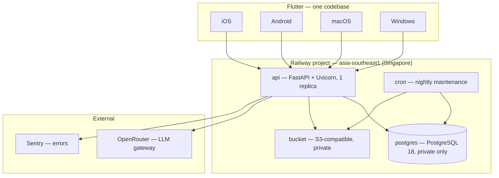
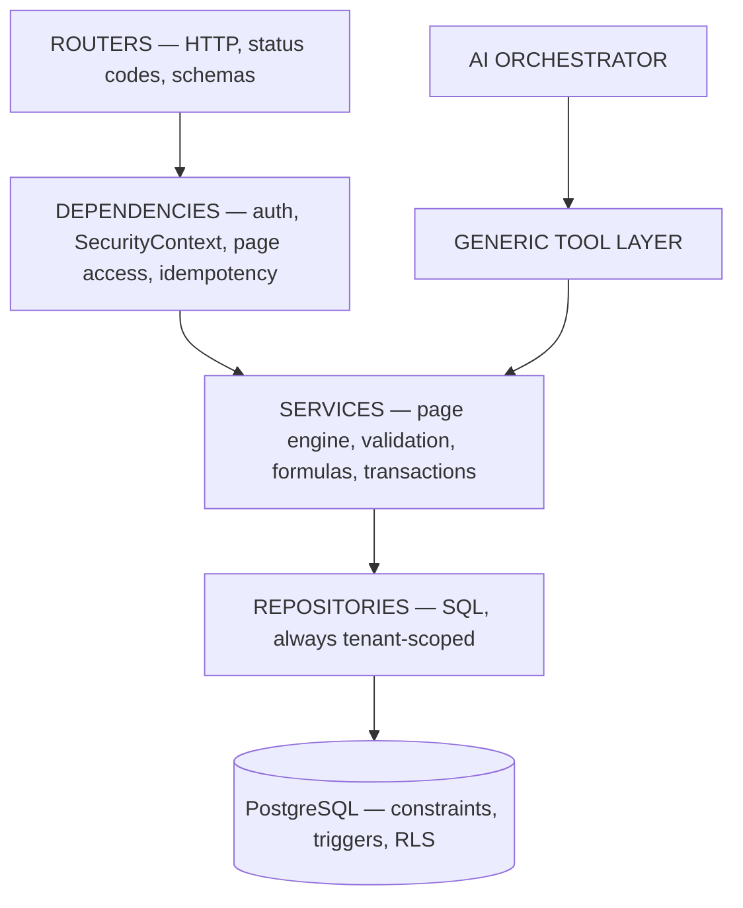
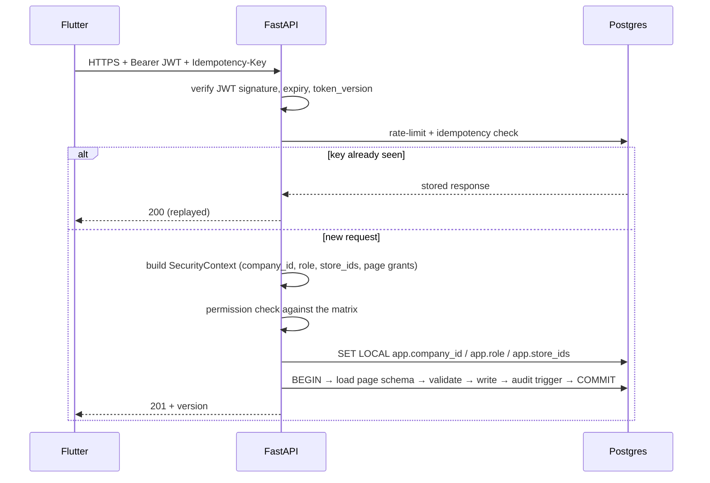
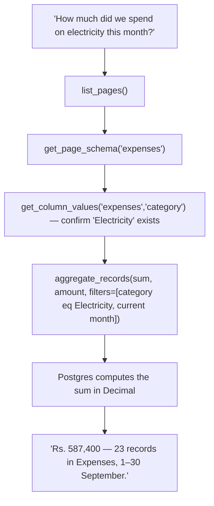

# Velmart — Architecture

**Status:** Build-ready · derived from [PROJECT_PLAN.md](PROJECT_PLAN.md) (v4.1, locked scope)
**Audience:** Anyone writing or reviewing code in this repository.

This document explains *how the system is built*. The [project plan](PROJECT_PLAN.md) explains
*what is being built and why*; material decisions are recorded in [ADRs](ADR/).

---

## 1. The one fact that shapes everything

**Velmart ships exactly six business tables — `employee_salaries`, `purchases`, `expenses`, `daily_revenue`, `cash_ledger`, `cheques` — and the Owner creates everything else.**
Those six are real, typed, natively-stored tables whose totals are computed by the database.
Nothing else ships: no suppliers, no employees, no card settlements.

```
Owner → creates Page → defines Columns → enters Records → adds Formulas/References → asks the AI
```

**Both kinds of table look identical from every direction except storage.** Each shipped table is
registered as a *system page* — a row in `pages` with `is_system = true` and `storage_table` naming
its table, plus its `page_columns` rows — so the same endpoints, AI tools, dynamic forms,
permissions and audit trail serve both. See [ADR 0006](ADR/0006-prebuilt-business-tables.md).

Three consequences a developer feels daily:

1. **Creating a business table requires no migration and no deploy** — *unless* it is one of the
   six. Owner pages are rows in `pages` and `page_columns`; the six shipped tables change by
   migration.
2. **Every feature must still be generic.** Write code against `page_columns`, not against a table
   name. If you find yourself special-casing "expenses" outside the storage dispatch, stop.
3. **A system page has no rows in `records`.** Nothing is stored twice, and reserved page keys make
   the duplicate impossible to create.

---

## 2. System context



One API service, one database, one bucket, one cron job — sized for one shop and three users. See
[ADR 0003](ADR/0003-railway-only-infrastructure.md) for what was deliberately left out and the
measured trigger that would bring each piece back.

**No web app in V1.** Four native targets from one Flutter codebase.

---

## 3. Backend layering



| Layer | Directory | Responsibility | Must never |
|---|---|---|---|
| Routers | `app/routers/` | HTTP shape, status codes, response models | Contain business logic or build SQL |
| Dependencies | `app/dependencies/` | Auth, `SecurityContext`, page-access guards, idempotency | Be bypassed by any route |
| Services | `app/services/` | Page engine, validation, formulas, transaction boundaries | Trust caller-supplied tenancy |
| Repositories | `app/repositories/` | SQL, always tenant-scoped | Interpolate a column key into SQL |
| Database | migrations | Constraints, triggers, generated totals, RLS | Create a business table beyond the six |

**The AI orchestrator enters through the same service layer as a human request.** It gets no
privileged path and no schema knowledge the Owner has not defined. If a service refuses an operation
for a user, it refuses it for the AI acting as that user.

---

## 4. Request lifecycle



`SecurityContext` (`app/core/context.py`) is the only source of tenancy in the process. It is built
from the verified JWT plus a per-request read of `page_access` — grants are deliberately **not** in
the token, so revoking one takes effect immediately.

Rate limiting and idempotency live in Postgres, not Redis. At three users the table will not become
a bottleneck; the trigger for revisiting is measured contention.

---

## 5. Data model

### 5.1 The split

Two kinds of data, and only two.

| | Platform tables | Shipped business tables | Owner pages |
|---|---|---|---|
| Defined by | Alembic migrations | Alembic migration `0008` | The Owner, at runtime |
| Examples | `companies`, `users`, `pages`, `page_columns`, `audit_logs` | `employee_salaries`, `purchases`, `expenses`, `daily_revenue`, `cash_ledger`, `cheques` | "Vehicle Costs", "Suppliers" |
| Described by | — | a system page in `pages` | a page in `pages` |
| Stored in | themselves | their own native table | `records.data JSONB` |
| Changes via | a migration + deploy | a migration + deploy | a `POST /pages` call |

`pages` + `page_columns` describe **all** business data. Storage is one of exactly two places, never
both — see [ADR 0001](ADR/0001-page-engine-is-the-business-data-layer.md) and
[ADR 0006](ADR/0006-prebuilt-business-tables.md).

### 5.1a Storage dispatch

`pages.storage_table` is the switch, and `app/repositories/records.py` is the only place that reads
it:

```
storage_table IS NULL       →  records table, values in data JSONB
storage_table = 'expenses'  →  native expenses table
```

Daily reconciliation is the one workflow the page engine cannot express — it compares totals across
two tables for the same business date, and cross-page rollups are V2. It is the
`daily_reconciliation` database view plus a dedicated endpoint, and is the only place a shipped
table gets a bespoke API surface.

One repository interface covers both, so `record_service`, `query_service`, the CSV pipeline and
every AI tool call the same methods regardless of backing store. Filters and sort keys are mapped
from `page_columns` to real column names — **validated against the metadata, never interpolated**.

This dispatch is the main new source of complexity in the system and where bugs will concentrate.
The query/aggregate suite therefore runs the same assertions against a system page and an Owner page
holding matching data, and requires identical results.

### 5.2 Storage: JSONB with typed projections

Values live in `records.data JSONB` with a GIN index, validated on write by a Pydantic model built
at runtime from `page_columns` (`app/schemas/dynamic.py`). JSONB does not mean untyped.

For columns the Owner marks indexed, the platform maintains a **fixed** set of projection columns on
`records` — `num_1..num_4`, `date_1..date_2` — mapped per page via `pages.projection_map`. Four
numeric and two date projections cover every realistic page, and the mapping is data rather than
schema.

Aggregation happens in Postgres over projection columns or `(data->>'x')::numeric` — **never**
summed in Python across pages.

### 5.3 Schema reference

The full DDL is [PROJECT_PLAN §8](PROJECT_PLAN.md). It is implemented in
`apps/api/alembic/versions/0001`–`0007`, with SQLAlchemy models in `apps/api/app/models/`.

| Migration | Creates |
|---|---|
| `0001_tenancy_and_users` | extensions, `companies`, `company_settings`, `stores`, `users`, `user_stores`, `refresh_tokens`, `idempotency_keys`, DB roles |
| `0002_page_engine` | `pages`, `page_columns`, `page_validations`, `page_access`, `records` + indexes |
| `0003_attachments_imports` | `attachments`, `import_batches` |
| `0014_remove_import_and_validation_rules` | Drops `page_validations`, `import_batches`, and `import_batch_id` (on `records` + all six business tables) — both features were later removed entirely by product decision |
| `0004_dashboard_widgets` | `dashboard_widgets` |
| `0005_audit_trigger_hashchain` | `audit_logs` + hash-chain trigger, `REVOKE` from `app_user` |
| `0006_rls_policies` | RLS + `tenant_isolation` on tenant tables, `store_scope` on `records` |
| `0007_ai_tables` | `ai_sessions`, `ai_messages`, `ai_proposals`, `ai_proposal_items`, `ai_reader` grants |
| `0008_business_tables` | `pages.is_system` / `storage_table`; the six core tables with their CHECK constraints and generated totals; the `daily_reconciliation` view; RLS; `ai_reader` grants |

**No migration may create a business table beyond the six in `0008`.** A seventh domain is an
Owner-created page.

---

## 6. The page engine

This is not a feature of Velmart. This *is* Velmart. Budget accordingly — P3 is four weeks and
should not be squeezed.

### 6.1 Column types

Fifteen types. `NUMBER`, `CURRENCY`, `DATE`, `DATETIME` are indexable (allocate a projection);
`SELECT` can be marked protected; `FORMULA` is computed on read and never stored.

`RECORD_REF` with a configurable `target_page_key` is the **only** relationship mechanism. There is
no `SUPPLIER_REF` or `EMPLOYEE_REF` — no suppliers or employees table ships, and hard-coding those
reference types would presuppose one. (`cheques.payee_name` and `employee_salaries.employee_name`
are plain text for the same reason.)

### 6.2 Schema evolution

| Change | Allowed | Handling |
|---|:---:|---|
| Add column | ✅ | Existing records get `null`; required-ness applies to new writes only |
| Rename display name | ✅ | `key` never changes; only `name` |
| **Change `key`** | ❌ | Would orphan every existing value |
| Widen type (NUMBER → TEXT) | ✅ | Lossless |
| Narrow type (TEXT → NUMBER) | 🟡 | Dry run reports how many rows would fail; explicit confirmation |
| Delete column / page | 🟡 | Archive first; hard delete later, values written to audit first |

### 6.3 The mechanisms that make it do accounting

| Mechanism | Where | Rule |
|---|---|---|
| **Formula columns** | `app/core/expressions/`, `formula_service` | `ast.parse` + whitelist visitor. **No `eval`/`exec`.** Evaluated in `Decimal`, on read, never stored — so it cannot drift from its inputs. Cycles rejected at save time |
| **References** | `reference_service` | Target must exist, same company, configured page. Deleting a referenced record is blocked |
| **Protected columns** | `protected_field_service` | Any `SELECT` column; only Owners may set or change the value; every change audited as `PROTECTED_FIELD_CHANGE` |

(**Validation rules** — `page_validations`, Owner-written cross-column ERROR/WARNING expressions —
were removed entirely by later product decision. `needs_review` is still a real platform field,
consumed by the review queue and the `REVIEW_QUEUE` dashboard widget type; nothing sets it `true`
any more.)

Allowed in expressions: `+ - * / ( )`, comparisons, `if/else`, and
`sum, min, max, round, abs, safe_div, days_between, today, coalesce`. Operands are column keys on the
same page, or literals. Length and nesting depth are capped.

---

## 7. Money and time

**Money never touches a float.**

| Layer | Representation |
|---|---|
| Postgres | `NUMERIC(14,2)` in projections; a **string** in JSONB (`"35000.00"`) |
| Python | `decimal.Decimal` everywhere; rounding half-up to 2dp, defined once in `app/core/money.py` |
| Dart | Crosses the wire as a **string**, parsed into a `Money` value object backed by `int` minor units |

Dart's `double` is IEEE-754 and will silently produce `Rs. 812,399.99`.

**Four timestamps, each with a job:** `occurred_at` (when it happened), `business_date` (the
accounting day), `created_at` (when it was entered), `updated_at` (last changed).

`business_date` is derived **server-side** from the page's designated date column
(`pages.date_column_key`) or, failing that, from `occurred_at` and `company_settings.day_cutoff_hour`
(default 02:00). A shop that closes at 11 p.m. and cashes up at 12:30 a.m. posts that cash to the
*previous* business date. Getting this wrong is the most common source of "the numbers don't match"
in retail software.

Everything is stored UTC and rendered in **Asia/Colombo**. LKR only; `companies.currency` exists so
multi-currency is a later extension rather than a rewrite.

---

## 8. Security architecture

### 8.1 Defence in depth

| Layer | Control |
|---|---|
| Client | Hides what the backend would refuse — **decides nothing** |
| Router | `require_owner`, `require_page_access` guards |
| Service | The `page_access` grant check; business rules |
| Repository | Every query tenant-scoped from `SecurityContext` |
| Database | RLS `tenant_isolation` + `store_scope`; separate roles `app_user` / `ai_reader` / `migrator` |

The permission matrix lives in **exactly one place** — `app/core/permissions.py` — and is exercised
by a parametrised test walking every role against every endpoint. Adding an endpoint without a
matrix row fails CI. See [ADR 0005](ADR/0005-two-roles-managers-cannot-edit.md).

### 8.2 Authentication

Access JWT (15 min) with claims `sub`, `company_id`, `role`, `store_ids`, `jti`, `exp`, `iat`,
`token_version`. Refresh tokens are hashed, device-bound, 30 days, and **rotated** on use — reuse of
a revoked token is treated as theft: revoke the device family and alert.

Bumping `users.token_version` invalidates every session for that user instantly, which is what
happens when a role changes or an account is deactivated.

Argon2id (m=64MB, t=3, p=4), minimum 10 characters, lockout after 5 failures.

### 8.3 Audit — tamper-evident by construction

`audit_logs` is append-only: `REVOKE UPDATE, DELETE, TRUNCATE` from `app_user`. Rows are
**hash-chained** by a Postgres `BEFORE INSERT` trigger (`fn_audit_logs_hash_chain`), not by
application code, so no code path can skip it:

```
row_hash = sha256(prev_hash || company_id || actor_user_id || action ||
                  entity_type || entity_id || old_data || new_data ||
                  source || created_at)
```

A nightly cron job verifies the chain and alerts on any break. Schema changes are audited as heavily
as data changes — when the Owner builds the structure, "who added this column" matters as much as
"who changed this number". Retained seven years.

---

## 9. The AI layer

> The LLM interprets and reasons. The backend controls permissions and arithmetic. The database
> stores the truth. The Owner controls every change.

**AI is Owner-only at every layer** — the manager's navigation has no AI tab (absent, not greyed
out), every `/ai/*` route has `Depends(require_owner)`, the orchestrator refuses to start if
`ctx.role != OWNER`, every tool re-checks the injected context, and a test asserts 403 on every AI
endpoint for a manager token.

### 9.1 How it understands a business it has never seen



Every step is a generic tool. The same sequence answers a completely different question against a
completely different table structure, with no code change. **The LLM never invents schema** — if the
Owner has no revenue table, the correct answer is to say so.

### 9.2 Read and write paths

- **Read** runs on the `ai_reader` role: `SELECT` only, 8-second statement timeout. Budgets per
  message: 8 tool calls, 12 seconds, 2,000 rows, 25,000 tokens of tool output. Every answer carries
  provenance — page, record count, date range.
- **Write** never writes. Tools create proposals; the server computes the diff; the Owner presses
  UPDATE. See [ADR 0004](ADR/0004-ai-proposal-flow.md) for the full contract, guardrails, and
  injection defence.

`ctx: SecurityContext` is injected server-side and never appears in a tool's JSON schema. CI fails
the build if it does.

### 9.3 Cost control

Daily cap (`company_settings.ai_daily_usd_cap`, default $3), 25k input / 4k output tokens per
message, task-routed models, last 10 turns verbatim with older turns summarised, and an
`ai_enabled = false` kill switch that works with **no deploy**. Expect $5–20/month.

---

## 10. Offline and sync

| Operation | Offline |
|---|:---:|
| View cached records (last 60 days), schemas, dashboard | ✅ |
| **Create a record** | ✅ queued |
| Queue an attachment | ✅ |
| Edit / delete a record, change a protected value | ❌ |
| Create or change pages and columns | ❌ |
| AI, CSV export | ❌ |

**Creates only.** Each queued record carries a device-generated `client_uuid` which is the
idempotency key end to end; `ux_records_client_uuid` guarantees replay safety. The client validates
against the cached schema, but **the server always re-validates** — if the Owner changed the page
while a manager was offline, the queued record is rejected with a clear explanation rather than
written against a stale schema.

The outbox drains FIFO per page so ledger sequences hold. Pending items are visibly marked; silence
about unsynced data is how money goes missing. The local Drift cache is SQLCipher-encrypted and
cleared on logout.

---

## 11. Client architecture

One Flutter codebase, three layouts driven by width:

| Width | Shell |
|---|---|
| < 600 dp | Bottom navigation, single pane, FAB to add |
| 600–1024 dp | Navigation rail, master-detail |
| > 1024 dp | Permanent sidebar, dense spreadsheet-style grid, column filters, AI side panel |

The field renderer directory (`features/pages/presentation/widgets/field_renderers/`) is where most
of the client's value sits — **one renderer per column type**. Get those right and every table the
Owner ever invents renders correctly with no further work.

The manager build never renders an AI tab, a page builder, or a column editor. A greyed-out feature
invites requests for access; an absent one does not.

---

## 12. Invariants — the things that must never be violated

1. **Exactly six pre-built business tables.** The Owner defines every other business structure; a
   seventh domain is a page, not a migration.
2. **One source of truth** per business record — a native table *or* `records`, never both. A system
   page has no rows in `records`, and reserved page keys block the duplicate.
3. Money is `NUMERIC(14,2)` / `Decimal` / integer minor units. **Never floating point.**
4. Every permission is enforced in FastAPI **before any query runs**.
5. The AI never writes to the database; only the Owner's UPDATE does.
6. The AI never invents schema; it discovers the Owner's.
7. Every mutation — data *and* schema — writes an audit entry; the log is append-only and
   hash-chained.
8. `company_id` scoping at the repository layer, RLS behind it, page grants in the service layer.
9. No raw SQL from the model; **no `eval`/`exec`** for formulas, validations, or filters. Column
   keys are validated against `page_columns` and mapped to safe expressions, never interpolated.
10. Offline allows creates only, with idempotency keys and server-side re-validation.
11. Nothing ships until the permission matrix, page-access, and tenancy isolation suites are green.
