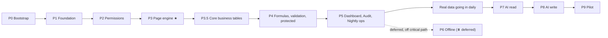

# Velmart — Step-by-Step Implementation Plan

**Derived from:** [PROJECT_PLAN.md](PROJECT_PLAN.md) §26 (roadmap), §24 (testing), §22 (file structure)
**Purpose:** Turn the plan into an ordered, checkable sequence of work with a definition of done at
every step.

- **Total:** ~25 weeks, one developer (≈60% of that with two)
- **The six core tables usable from the end of P3.5** (about week 11)
- **Full data-entry platform from the end of P5** (about week 17)
- **AI from the end of P8** (about week 23)

---

## How to use this document

Work top to bottom. Each phase has **prerequisites**, **numbered steps** naming the files they
touch, **tests to write**, and a **done-when** that is a demonstrable outcome, not "the code is
written".

Two rules that override any schedule pressure:

> **1. P3 is the product.** If the page engine is excellent, everything after it is
> straightforward. If it is mediocre, no amount of AI will rescue it. Budget the full four weeks and
> **do not let it be squeezed.**
>
> **2. Do not start P7 (AI) before P4 and P5 are solid and real data is going in daily.** The AI is
> only as good as the data and schemas underneath it. Building it earlier means debugging two things
> at once, and the AI will get blamed for data problems it did not cause.

---

## Current status

> **Later feature removal (post-P5), read this before the rows below:** CSV import, the entire
> `page_validations` (Validation Rules) system, and dashboard widget *creation* (`POST
> /dashboard/widgets`, starter suggestions, the "Add widget" flow) were all removed completely by
> product decision — code, schema, tests, docs, dependencies. Every row below that describes
> building one of these (P3.5's CSV import half, P4's `page_validations`, P5's widget CRUD/starter
> suggestions) is an accurate historical record of what was built *at the time*, not a description
> of the current codebase. CSV **export**, dashboard widget **viewing/evaluation**, and widget
> **edit/delete** (an Owner can still `PATCH`/`DELETE` an existing widget) were all explicitly kept
> and are unaffected. See `docs/PROJECT_PLAN.md` §11.3, §13, §15 for the current, accurate state.

| Item | State |
|---|---|
| Monorepo file structure (§22) | ✅ Scaffolded — all directories and files exist, empty |
| Database schema (§8) | ✅ Implemented — Alembic `0001`–`0007` + SQLAlchemy models |
| Core business tables (§8.9) | ✅ Fully implemented — Alembic `0008` (six tables + reconciliation view) + `app/models/business/`, plus P3.5's full service layer (storage dispatch, reconciliation, CSV import/export) |
| Documentation (`docs/`) | ✅ Plan (v4.1), architecture, API, runbook, 6 ADRs |
| **Phase 0 — complete (0.1–0.8)** | ✅ Done and **verified against real PostgreSQL 18.6**: full `0001`→`0008` chain applies, reverses to base, and re-applies; `/health/ready` returns 200 as `app_user` |
| Verified live | Generated totals compute and follow updates · negative amounts and direct writes to generated columns rejected · `daily_reconciliation` correct (incl. missing-ledger dates) · audit hash chain links and is append-only for `app_user` · RLS tenant isolation holds |
| **P1 backend — auth (1.4–1.11)** | ✅ Done — money, business dates, Argon2id auth (login/refresh/logout/me), Postgres-backed rate limiting and idempotency, migration `0009`. **81 tests green against real PostgreSQL** |
| **P2 backend — roles and permissions** | ✅ Done — `SecurityContext`, `app/core/permissions.py` matrix, `require_owner`/`require_page_access` guards, users/stores endpoints, migration `0010` (SECURITY DEFINER pre-auth lookups). Real RLS enforcement as `app_user`, not the container superuser |
| **P3 backend — page/table engine (3.1–3.11)** | ✅ Done — page/column schema service (all 15 types, projection allocation, schema evolution incl. narrow-dry-run), the runtime Pydantic model (`app/schemas/dynamic.py`), record CRUD with optimistic locking and idempotency, query/aggregate/column-values (injection-safe keyset pagination), page-access grants. FORMULA evaluation, `RECORD_REF` integrity, `page_validations` enforcement, and protected-column enforcement are explicitly P4 — see that phase's plan. **227 tests green against real PostgreSQL.** |
| **P3 client (3.12–3.18)** | ✅ All Dart source written and now compiler-verified — domain models, `PageRepository` (one method per endpoint), all 15 column types across 9 field renderers + dispatcher, `page_list`/`record_list`/`record_detail`/`record_form`/`filter_sheet`/`page_builder`/`column_editor`/`access_editor` screens, the adaptive shell (bottom nav/rail/sidebar), routing. Two real bugs caught by the original hand-review: a `library;` directive placed after its imports (invalid Dart — also found and fixed in the pre-existing P2 `can.dart`), and a `.firstOrNull` call that silently depended on `package:collection` without declaring it. A real **backend gap** found while building the access editor: there is no `GET /pages/{id}/access`, only `PUT` — the client can't show current grants before replacing them; worth a small backend follow-up. 6 test files added (`page_parsing`, `page_repository` w/ mocktail, `field_renderer`, `adaptive_scaffold`, `business_date`); `record_form`/`record_list` widget tests were swapped for the lower-level `field_renderer_test.dart` since those screens are deeply coupled to go_router navigation context, too fragile to mock blind. `dart analyze --fatal-infos` and `flutter test` now run clean against a real Flutter SDK (see the P1 client row's "Verification gap closed" note). |
| **P3.5 backend (3.5.1–3.5.11, 13.1–13.2)** | ✅ Done — storage-dispatch layer (`app/repositories/records.py`) so `record_service`/`query_service` treat a system page's native table exactly like an Owner page's JSONB `records`; all six system pages registered and seeded (`register_system_pages`, `infra/scripts/seed_demo.py`); reserved-key rejection and system-page immutability (already worked from P3, now tested); generated columns (`total_revenue`/`total_amount`) read-only; protected-field endpoint for `cheques.cheque_status` (pulled forward from P4 §4.7); `GET /reconciliation`; CSV export (`POST /pages/{id}/export`, direct response body — a **documented deviation** from §13.2's presigned-URL design, since `app/storage/` is an unbuilt P5 dependency); CSV import (`app/routers/imports.py`: preview/validate/commit/rollback, fuzzy column-name mapping via `difflib`, money/date normalisation, ambiguous-date DMY/MDY/YMD hints, natural-key skip/update/create-anyway dedup, 24-hour rollback). **297 tests green against real PostgreSQL as `app_user`**, plus manual end-to-end verification of export, import, and rollback against a seeded demo company. |
| **P3.5 client (3.5.12–3.5.13, 13.1–13.2)** | ✅ All Dart source written and now compiler-verified — reconciliation screen + repository/domain model; CSV export wired to the OS share sheet (`share_plus`) with a fix for a real bug found by hand-review (Dio's `responseType: bytes` also turns a structured *error* body into raw bytes, which would have shown a generic message instead of the real 403 reason); the full CSV import wizard (`csv_import_screen.dart`: file pick via `file_picker` → mapping review → validate → commit) plus `import_history_screen.dart` for rollback; a real gap found and fixed while verifying the six system pages render correctly — `PageSchemaOut`/`PageSchema` had no way to mark a generated column read-only on the client, so `total_revenue`/`total_amount` would have rendered editable and 422'd on submit. A real API-drift bug surfaced only once the pinned `share_plus: ^10.1.4` was actually compiled against: this row's CSV export call used the share_plus 11+ `SharePlus.instance.share(ShareParams(...))` shape, which doesn't exist in 10.1.4 — fixed to `Share.shareXFiles(...)`, the API the pinned version actually has (see the P1 client row). |
| **P4 backend (4.1–4.9, 4.11)** | ✅ Done — two real pre-existing bugs fixed first (`SetProtectedFieldRequest.column` renamed to `column_key` to match the documented contract; `_check_protected_on_update` now compares submitted-vs-current value instead of rejecting on mere key presence, so editing an unrelated field on a record with a protected column no longer 403s). Safe expression parser (`app/core/expressions/parser.py`: default-deny AST whitelist, length/depth caps), function library, and a `Decimal` evaluator for row-bounded reads; a second backend (`sql_compiler.py`) compiles the same whitelist grammar to SQL so a FORMULA column is filterable/sortable/aggregatable through `resolve_column`, exactly like a real column. Formula dependency-graph cycle detection at column-save time (`FORMULA_CYCLE`). `RECORD_REF` existence checking (`reference_service.py`) and delete-blocking (`REFERENCED_RECORD_EXISTS`), identical rejection for a target in the wrong page or another company. `page_validations` (`validation_service.py`): `ERROR` blocks the save with its own message; `WARNING` saves and sets `needs_review`, recorded on the audit entry. Ledger pages (`kind=LEDGER`): in-place edits rejected (`LEDGER_RECORD_IMMUTABLE`), `POST /records/{id}/reverse` flips the original to `REVERSED` and creates a linked replacement via `reverses_id` through `create_record`'s own pipeline, `GET /pages/{id}/running-balance` as a SQL window function over `ACTIVE` rows (migration `0011`, `pages.balance_column_key`). Review queue: `needs_review`/`status` are filterable/sortable platform fields through `resolve_column`, same as a formula. Four real bugs found and fixed during this work, not just at the end: a wire-format/Python-type mismatch that would have done string arithmetic on formula operands; a pydantic `Field(default=...)` value that is never itself validated (a SELECT column's configured default could be outside its own `options`); a `_coerce` gap that crashed formula filtering (`operator does not exist: numeric > character varying`) and a companion gap that would have silently truncated keyset-paginated results when sorting by a formula; and three invalid SQLAlchemy expressions in the first draft of `sql_compiler.py` (`round`, `today`, `days_between`). **364 tests green against real PostgreSQL as `app_user`** (up from 297 at the end of P3.5). A separate, explicitly `@pytest.mark.slow` volume benchmark (`tests/perf/test_volume.py`, excluded from the default run via `addopts = "-m 'not slow'"`) seeded 100k rows into both a generic and a native-table page and measured real endpoint latency: filter+sort, aggregate (including over a FORMULA column), and a native-table aggregate all ran in 30–70ms; `running-balance`'s single unpaginated pass over all 100k rows took ~690ms — over the plan's 400ms target, but a materially different shape of work (every matching row in one response, not a `limit`-capped page) rather than a regression, and reported honestly rather than the target being loosened to make it pass. |
| **P4 client (4.10)** | ✅ All Dart source written and now compiler-verified — `record_form_screen.dart`'s `writableColumns` already excluded protected/generated/read-only columns from submission (closing the "any edit 403s" bug at its root, not just server-side); `record_detail_screen.dart` already had a dedicated "Change {name}" action calling the protected-field endpoint. New this phase: `validation_editor_screen.dart` (list/add/edit/archive a page's `page_validations` rules, Owner-only, wired into `page_list_screen.dart`'s menu and `app_router.dart`); a real gap found in `record_ref_field_renderer.dart` — a `RECORD_REF` column with no `display_column` override fell straight through to the raw record id instead of using the target page's own `displayColumn` heuristic. That fix's first draft assumed `displayColumn` lived on `Page` itself; compiling for real this session showed it only ever existed on `PageSchema` (which needs the target page's columns) — corrected to watch `pageSchemaProvider(targetPage.id)` for the schema instead, falling back to no override while it loads. `formula_field_renderer.dart` needed no change — it already renders a present value or "Computed automatically" correctly, now that the server actually populates one. A live formula preview in the page builder and the review-queue dashboard screen are explicitly out of scope for this phase (P5's, and a second Dart evaluator implementation respectively) — see the P4 plan's own scope notes. |
| **P5 backend (Audit, Dashboard, Nightly ops)** | ✅ Done — delivered as three vertical slices, **Attachments deferred** (see the P5 plan's own scope note; not implemented). **Audit**: `write_audit_log` gained `page_id`, backfilled at all 17 real call sites (the 13 originally identified plus 4 more found during implementation — CSV import/import-rollback/export, protected-field change); `AuditAction` enum rewritten to match every real action string in use; new `app/repositories/audit.py` (keyset pagination on `audit_logs.id`), `app/services/audit_read_service.py` (plain-sentence formatter, "via AI" suffix, generic fallback for unmatched actions), `GET /audit-logs` (🟡 manager sees only view-granted pages, `page_id IS NULL` rows Owner-only) and `GET /audit-logs/export` (Owner-only CSV). A real bug found and fixed along the way: `require_page_access`'s `PERMISSION_DENIED` audit write was silently lost on the denial path (no commit before the guard's own raise) — the same bug already fixed in `require_owner`, now fixed here too. **Dashboard**: widget CRUD + evaluation (`METRIC`/`TREND`/`BREAKDOWN`/`LIST`/`REVIEW_QUEUE`) reusing `query_service`'s existing `AggregateRequest`/`QueryRequest` shapes rather than a parallel query DSL (`TREND`'s day/week bucketing is the one dedicated SQL query, since `query_service` has no time-bucketing); `list_widgets`/`evaluate_widget` double-gated on `visible_to` role **and** page view-access — a real gap found and fixed: `evaluate_widget` initially checked only page access, letting a manager reach a role-hidden widget's data directly by id; starter-widget suggestions (never persisted until accepted). **Nightly ops**: new `migrator` DB role path (`app/db/migrator.py`, migration `0012`, `BYPASSRLS`) for cross-tenant jobs, since the audit hash chain is a single **global** chain (migration 0005's trigger has no `WHERE company_id`), confirmed by a dedicated two-company interleaving test; `audit_chain_verify.py` recomputes each row's hash in one `LAG()`-based SQL query rather than reimplementing the trigger's formula in Python (avoids a JSONB/timestamp serialization mismatch); `idempotency_cleanup.py` (thin wrapper over the already-implemented `purge_expired`); `daily_digest.py` (new `daily_digests` table, migration `0013`, one row per company per day, exposed via `GET /dashboard/digest`); `export_build.py` (nightly `pg_dump`, **bucket upload explicitly deferred** — same scope decision as Attachments, `uploaded` always `False`, documented in the module docstring); `nightly.py` orchestrator running all four jobs independently and reporting overall failure without stopping the others. **425 tests green against real PostgreSQL as `app_user`** (up from 364 at the end of P4), `ruff`/`mypy` clean. |
| **P5 client (Audit, Dashboard)** | ✅ All Dart source written for the two slices with a Flutter surface (Nightly ops is backend/ops-only, per the plan), now compiler-verified. `lib/features/audit/` (domain/repository/providers/screen — date-header-grouped list, filter bar, Owner-only export button gated by a new `canExportAuditLog`); `lib/features/dashboard/` extended with widget CRUD/evaluate/suggest calls, `widget_builder_screen.dart` (0 bytes → real form), and `home_screen.dart` rewritten from its P3.5-era placeholder into real widget rendering (`fl_chart` `LineChart` for `TREND`, a plain-Flutter proportional-width bar list for `BREAKDOWN`). A previously-fixed bug class recurred and was fixed the same way again: Dio's `responseType: bytes` hiding a structured error body on the audit CSV export, fixed by extracting the existing one-off CSV-export fix into a shared `decodeBytesResponseError` instead of duplicating it. Avoided a previously-documented bug class (a bare `.firstOrNull` without `package:collection`) in `widget_builder_screen.dart` by using a manual loop instead. Compiling for real this session found the same share_plus API-version mismatch as P3.5's export (`audit_screen.dart`'s export button used the share_plus 11+ shape against the pinned 10.1.4 — fixed to `Share.shareXFiles(...)`), and a `Page`/`flutter/material.dart` name collision in `widget_builder_screen.dart` (fixed with `hide Page` on the material import) — see the P1 client row's "Verification gap closed" note for the full list across all phases. |
| **P1 client (1.12–1.17)** | ✅ All Dart source written — pubspec, Dio client + interceptors, secure storage, `Money` (int minor units), auth repository/controller, login + home screens, go_router guards. **Verified for real this session**: a Flutter SDK (3.47.3 stable) was located and used to run `flutter pub get`, `dart analyze --fatal-infos` (clean), `flutter test` (71 tests, all green), `flutter create --platforms=ios,android,macos,web .` (generated the missing platform folders without touching existing app code), and `flutter build web --debug` (succeeded — proves the full app compiles end to end; native `macos`/`ios`/`android` builds remain blocked only by this environment's incomplete Xcode/absent Android SDK, not by the code). See the P1 client Client section below ("Verification gap closed") for the full list of real bugs this caught across every phase. |
| Railway project, CI | ⛔ Not created — P1 |

---

## Working agreement

**Definition of done for any step**

1. Code written and type-checked (`ruff`, `mypy` / `dart analyze` clean).
2. Tests written *and passing* — not "tests to follow".
3. If it mutates data or schema, it writes an audit entry, and a test asserts that.
4. If it is an endpoint, it has a row in the permission matrix, and the matrix suite covers it.
5. Money paths use `Decimal` / `int` minor units. No `float` anywhere near a monetary value.

**Conventions**

- Migrations are hand-authored and touch platform tables plus the six core business tables of
  `0008`. **No migration creates a seventh business table** — that is an Owner-created page.
- No `eval` / `exec`, ever — formulas and validations go through the whitelist parser.
- Column keys are validated against `page_columns` and mapped to safe expressions, never
  interpolated into SQL.
- The permission matrix lives in exactly one file: `app/core/permissions.py`.

---

## Phase 0 — Bootstrap the runnable skeleton

*Not in the original roadmap; it is the gap between "files exist" and "P1 can start".*

| # | Step | Files |
|---|---|---|
| 0.1 | Fill `pyproject.toml` with the full dependency set (FastAPI, Pydantic v2, SQLAlchemy, asyncpg, Alembic, argon2, structlog, boto3, httpx, pytest, testcontainers) and generate `uv.lock` | `apps/api/pyproject.toml`, `uv.lock` |
| 0.2 | `config.py` with pydantic-settings validating **every** env var at boot — a missing secret must crash the container immediately | `app/config.py`, `.env.example` |
| 0.3 | Async engine + session factory; `app_user` for writes, `ai_reader` for AI reads | `app/db/session.py`, `app/db/readonly.py` |
| 0.4 | `SET LOCAL app.company_id / app.role / app.store_ids` helper for RLS | `app/db/rls.py` |
| 0.5 | `main.py` with the app factory, RFC 9457 error handlers, request-id middleware, structlog JSON logging | `app/main.py`, `app/core/errors.py`, `app/core/logging.py` |
| 0.6 | `/health` and `/health/ready` (ready = DB reachable **and** migrations at head) | `app/routers/health.py` |
| 0.7 | Local Docker Compose (Postgres 18 + API) for development | `infra/` |
| 0.8 | **Run `alembic upgrade head` against real Postgres, then `downgrade base`, then up again** | — |

**Done when:** `docker compose up` gives a working API, `/health/ready` returns 200, and the full
migration chain applies and reverses cleanly against a real PostgreSQL 18.

---

## P1 — Foundation · 2 weeks

**Goal:** A user logs in from a phone and a Windows laptop against the live Railway API.

**Prerequisites:** Phase 0.

### Backend

| # | Step | Files |
|---|---|---|
| 1.1 | Multi-stage non-root Dockerfile | `infra/Dockerfile.api`, `apps/api/Dockerfile` |
| 1.2 | Railway project in `asia-southeast1`: `api`, `postgres` (PITR **on**), `bucket`, `cron`. Set the workspace **spend limit** | `infra/railway.json` |
| 1.3 | Migrations as a **pre-deploy** step, never in the start command | `infra/railway.json` |
| 1.4 | Sentry for Python, release-tagged, PII scrubbed | `app/main.py` |
| 1.5 | `money.py` — `Decimal` parsing, half-up rounding to 2dp, defined once | `app/core/money.py` |
| 1.6 | `dates.py` — `business_date` derivation, `day_cutoff_hour`, Asia/Colombo | `app/core/dates.py` |
| 1.7 | `security.py` — Argon2id (m=64MB, t=3, p=4), JWT encode/decode | `app/core/security.py` |
| 1.8 | `POST /auth/login` — lockout after 5 failures, generic 401, audited | `app/routers/auth.py`, `app/services/auth_service.py` |
| 1.9 | `POST /auth/refresh` — rotation, `replaced_by`, **reuse ⇒ revoke the device family** | same |
| 1.10 | `POST /auth/logout`, `GET /me` | `app/routers/auth.py` |
| 1.11 | Postgres-backed idempotency and rate limiting | `app/core/idempotency.py`, `app/core/ratelimit.py` |

### Client

| # | Step | Files | Status |
|---|---|---|---|
| 1.12 | Flutter shell building on **all four targets** | `apps/mobile/` | ✅ `flutter create --platforms=ios,android,macos,web .` run against the existing `pubspec.yaml`/`lib/`, generating the missing platform folders non-destructively (existing app code untouched, confirmed via `git diff`) |
| 1.13 | Dio client + auth/retry interceptors | `lib/core/network/` | ✅ Written — bearer token attach, single-flight refresh-on-401 with device-family-safe coalescing, exponential-backoff retry gated on `Idempotency-Key` for non-GET |
| 1.14 | Secure token storage (Keychain / Keystore) | `lib/core/storage/secure_store.dart` | ✅ Written |
| 1.15 | `Money` value object backed by `int` minor units — **never `double`** | `lib/core/money/money.dart` | ✅ Written, with a unit test at `test/core/money_test.dart` mirroring `test_money_precision.py` |
| 1.16 | Login screen; display name + role | `lib/features/auth/` | ✅ Written — repository, `AuthState`/`AuthController`, login screen, home screen |
| 1.17 | go_router with role-based guards | `lib/routing/` | ✅ Written — redirect-based guard; **UI convenience only**, mirrors but never replaces the server-side matrix |

**Verification gap closed.** A Flutter SDK (3.47.3 stable) was located and put on `PATH`, and every
client file across every phase (P1–P5) was verified for real for the first time: `flutter pub get`,
`dart analyze --fatal-infos` (zero issues), `flutter test` (71 tests, all green), and
`flutter create` to generate the previously-missing `ios/`/`android/`/`macos/`/`web/` platform
folders, followed by `flutter build web --debug` (succeeded — the app compiles end to end, every
import resolves, no undefined symbols). Native `macos`/`ios`/`android` builds remain blocked in
*this* environment specifically (Xcode is Command Line Tools only, no full Xcode.app; no Android
SDK) — an environment limitation, not a code one; the web build already proves the whole dependency
graph and every screen compiles. Several real bugs, invisible without a compiler, were found and
fixed this way: two files (`currency_field_renderer.dart`, `date_field_renderer.dart`) importing
`core/money/money.dart`/`core/date/business_date.dart` one `../` short, so the import resolved to a
nonexistent path; three files where the app's own `Page` class collided with `flutter/material.dart`'s
`Page` (fixed with `hide Page` on the material import); a missing `dart:convert` import for
`jsonEncode` in `page_repository.dart`; `record_ref_field_renderer.dart` calling a `displayColumn`
getter that only ever existed on `PageSchema`, never on the plain `Page` the code had in hand (fixed
by watching `pageSchemaProvider` for the target page instead); and `SharePlus.instance.share(
ShareParams(...))` — the share_plus **11+** API — called against the pinned `share_plus: ^10.1.4`,
which only has `Share.shareXFiles(...)` (two call sites, `audit_screen.dart` and
`record_list_screen.dart`). One genuine test-only issue also surfaced: a Dart map literal
`'config': {}` with no downward type context infers as `Map<dynamic, dynamic>`, not
`Map<String, dynamic>` (real JSON via `jsonDecode` never has this problem) — fixed by typing the
test fixture explicitly, not by loosening the production parser. The two earlier hand-review
catches (an invalid `factory` constructor on an enum; a wrongly-`const` `Uuid()` call) were
confirmed still fixed. `mobile-ci.yml` remains the CI-side record of this same check on every push.

### CI

| # | Step | Files |
|---|---|---|
| 1.18 | `api-ci.yml` — ruff, mypy, pytest with testcontainers Postgres | `.github/workflows/` |
| 1.19 | `mobile-ci.yml` — `dart analyze`, `flutter test` | `.github/workflows/` |
| 1.20 | `deploy-production.yml` — main → Railway → healthcheck → smoke test | `.github/workflows/` |

**Tests:** `test_money_precision`, `test_business_dates` (including the midnight/cutoff boundary),
auth flow tests, `conftest.py` with testcontainers Postgres.

**Done when:** a real login works from a phone *and* a Windows laptop against the live Railway API,
and CI is green on `main`.

---

## P2 — Roles and permissions · 2 weeks

**Goal:** A manager token gets 403 on every owner-only endpoint, proven by an exhaustive suite.

**Prerequisites:** P1.

| # | Step | Files |
|---|---|---|
| 2.1 | `SecurityContext` — `company_id`, `user_id`, `role`, `store_ids`, page grants | `app/core/context.py` |
| 2.2 | **The permission matrix from §4.2, in exactly one file** | `app/core/permissions.py` |
| 2.3 | Auth dependency: verify signature, expiry, `token_version`; build the context | `app/dependencies/auth.py` |
| 2.4 | `require_owner`, `require_page_access` guards | `app/dependencies/guards.py` |
| 2.5 | Repository base — **every** query tenant-scoped from the context | `app/repositories/base.py` |
| 2.6 | Wire `SET LOCAL` into the session lifecycle so RLS is always armed | `app/db/rls.py`, `app/dependencies/db.py` |
| 2.7 | User management: create, edit, deactivate, change role (**bumps `token_version`**) | `app/routers/users.py`, `app/services/user_service.py` |
| 2.8 | Store management + `user_stores` assignment | `app/routers/stores.py` |
| 2.9 | Audit service writing through the hash-chain trigger; `PERMISSION_DENIED` on every 403 | `app/services/audit_service.py` |
| 2.10 | Client-side `can.dart` mirroring the matrix — **UI hints only** | `lib/core/permissions/can.dart` |

**Tests (all must be green — this is a release gate):**
`test_permissions_matrix` (parametrised over every role × endpoint; **adding an endpoint without a
matrix row fails CI**), `test_tenancy_isolation` (company A can never read or write company B, at
both the repository and RLS layers).

**Done when:** the permission matrix suite is green and a manager token gets 403 on every owner-only
endpoint.

---

## P3 — Page / table engine · 4 weeks · ★ THE PRODUCT

**Goal:** A non-technical Owner builds a five-column table on a laptop and a manager enters a record
on a phone, with no developer involved.

**Prerequisites:** P2 green. **Do not compress this phase.**

### Schema and validation

| # | Step | Files |
|---|---|---|
| 3.1 | Page service: create/edit, derive `key` from name, uniqueness, archive | `app/services/page_service.py` |
| 3.2 | Column service: all **15 types**, `key` immutability, position/reorder, archive | `app/services/schema_service.py` |
| 3.3 | Projection allocation for indexed NUMBER/CURRENCY/DATE/DATETIME → `projection_map` | `app/services/page_service.py` |
| 3.4 | **Runtime Pydantic model built from `page_columns`** — the heart of validation | `app/schemas/dynamic.py` |
| 3.5 | Schema evolution: widen freely; **narrow via dry-run + explicit confirm**; SELECT option add/remove with in-use warnings | `app/services/schema_service.py` |

### Records

| # | Step | Files |
|---|---|---|
| 3.6 | Record create — validate, derive `business_date`, populate projections, audit | `app/services/record_service.py` |
| 3.7 | Record read / update (Owner only, `If-Match`) / soft delete with reason | same |
| 3.8 | Query service: filters (`eq…is_null`), sort, trigram search — **column keys validated, never interpolated** | `app/services/query_service.py` |
| 3.9 | Aggregation in Postgres over projections: `sum, avg, count, min, max`, `group_by`, periods | same |
| 3.10 | `page_access` grants; default-deny; ungranted pages absent from every response | `app/routers/access.py` |
| 3.11 | Routers: `pages`, `columns`, `records`, `query` | `app/routers/` |

### Client — where most of the value sits

| # | Step | Files |
|---|---|---|
| 3.12 | **One field renderer per column type** | `lib/features/pages/presentation/widgets/field_renderers/` |
| 3.13 | Dynamic form built from the schema | `record_form_screen.dart` |
| 3.14 | Dynamic data table (grid on desktop, cards on mobile) | `record_list_screen.dart` |
| 3.15 | Filter sheet, sort, search | `filter_sheet.dart` |
| 3.16 | Page builder + column editor (Owner only) | `page_builder_screen.dart`, `column_editor_screen.dart` |
| 3.17 | Access editor (Owner grants managers) | `access_editor_screen.dart` |
| 3.18 | Adaptive shell: <600dp bottom nav · 600–1024dp rail · >1024dp sidebar + dense grid | `lib/core/widgets/adaptive_scaffold.dart` |

**Tests:** `test_page_engine`, `test_record_validation`, `test_query_filters` (**injection-proof**),
`test_page_access_grants`, `test_optimistic_locking`.

**Done when:** a non-technical Owner builds a five-column table unaided, and a manager enters a
record on a phone. This is a **usability** gate — watch someone do it; do not assume.

---

## P3.5 — Core business tables · 3 weeks · ✅ Done

**Goal:** All six core pages present on first login, behaving exactly like any other page — plus
daily reconciliation, the one workflow the page engine cannot express.

**Prerequisites:** P3. The page engine must exist first — this phase reuses its service layer rather
than duplicating it.

**Already done:** migration `0008_business_tables.py` (six tables, generated totals, CHECK
constraints, the `daily_reconciliation` view, RLS), `BusinessTableMixin` in `app/db/base.py`, the six
models under `app/models/business/`, `SYSTEM_PAGE_KEYS` / `RESERVED_PAGE_KEYS`, and
`pages.is_system` / `storage_table`.

| # | Step | Files |
|---|---|---|
| 3.5.1 | System-page registration: insert the six `pages` rows (`is_system = true`, `storage_table` set) and their `page_columns` — keys, types, display names, `is_protected` on `cheque_status`, `date_column_key` | `app/services/page_service.py` |
| 3.5.2 | Seed on company creation, so a new company has all six from first login | `infra/scripts/seed_demo.py`, `app/services/page_service.py` |
| 3.5.3 | **Reserved keys**: refuse `POST /pages` for `RESERVED_PAGE_KEYS`, including singular/plural variants → 409 `RESERVED_PAGE_KEY` | `app/services/page_service.py` |
| 3.5.4 | **System schemas immutable**: refuse `PATCH`/`DELETE` on a system page and any column edit → 409 `SYSTEM_PAGE_IMMUTABLE` | `app/services/schema_service.py` |
| 3.5.5 | **Storage dispatch** on `pages.storage_table` behind one repository interface | `app/repositories/records.py` |
| 3.5.6 | Map filter/sort/aggregate column keys → real column names via `page_columns`, **never interpolated** | `app/services/query_service.py` |
| 3.5.7 | Write path: `business_date` derivation, optimistic locking, `client_uuid` idempotency, audit — reusing `record_service`, not a parallel one | `app/services/record_service.py` |
| 3.5.8 | Generated columns read-only: reject `total_revenue` / `total_amount` in write bodies, always return them | `app/schemas/dynamic.py` |
| 3.5.9 | Surface DB constraint violations as 422 `VALIDATION_FAILED` with an Owner-facing message | `app/core/errors.py` |
| 3.5.10 | Protected-field endpoint drives `cheques.cheque_status`; manager blocked at create time too | `app/services/protected_field_service.py` |
| 3.5.11 | **Reconciliation service + `GET /reconciliation`** over the `daily_reconciliation` view, date-range filtered | `app/services/dashboard_service.py`, `app/routers/dashboard.py` |
| 3.5.12 | **Reconciliation screen**: Daily Revenue total, Cash Ledger total, Difference per date; zero difference clearly marked as matching | `apps/mobile/lib/features/dashboard/` ✅ |
| 3.5.13 | Flutter forms/screens for the six pages via the existing dynamic renderers — no bespoke form code unless a page genuinely needs it | `apps/mobile/lib/features/pages/` ✅ |
| 3.5.14 | CSV import/export over native tables through the same generic pipeline | `app/services/csv_service.py` ✅ |

All 14 steps done. CSV export (3.5.14, export half) is a **documented deviation** from
docs/PROJECT_PLAN.md §13.2's presigned-bucket-URL design: it returns the CSV directly in the
response body instead, since `app/storage/` (S3) is a P5 dependency that doesn't exist yet — the
Flutter client hands the bytes to the OS share sheet. CSV import (3.5.14, import half) covers
upload, encoding/delimiter detection, fuzzy column-name mapping, per-row validation (money
normalisation, ambiguous-date confirmation via an explicit DMY/MDY/YMD hint), natural-key duplicate
detection (skip/update/create-anyway), chunked commit, and 24-hour rollback — `app/services/
csv_service.py`, `app/routers/imports.py`, `apps/mobile/lib/features/pages/presentation/
csv_import_screen.dart` + `import_history_screen.dart`.

**Tests:** `test_reserved_page_keys` (including "Cheque" and "Salary" near-misses),
`test_system_page_immutable`, `test_business_table_constraints` (negative amounts rejected;
`total_revenue` recomputes when `cash_sales` changes; generated columns rejected in write bodies),
`test_reconciliation` (matching totals give zero; a 2,000 discrepancy is reported exactly; a date
with revenue but no ledger entry still appears), `test_storage_parity` (the same filter, sort and
aggregate assertions run against a **system page** and an **Owner page** holding matching data,
requiring identical results), `test_csv_export`, and `test_csv_import` (fuzzy mapping, money/date
normalisation, natural-key skip/update/create-anyway, commit + audit, rollback within and past 24
hours). 297 tests green against real Postgres as `app_user`.

**Done when:** a manager enters a purchase and a cheque on a phone, the reconciliation screen shows
a correct difference for a date where revenue and ledger disagree, `POST /pages {name:"Cheque"}`
returns 409, every query behaves identically across both storage backends, and an Owner can import
and roll back a CSV file for any of the six pages. ✅ Backend verified automatically (297 tests) and
manually end-to-end; Flutter now compiler-verified too (`dart analyze --fatal-infos` clean,
`flutter test` green) — see the P1 client row's "Verification gap closed" note.

---

## P4 — Business data and financial workflows · 4 weeks · ✅ Done

**Goal:** The Owner builds Expenses, Staff (with a Net Salary formula), and Cheques (with a
protected status), and every calculation matches a hand-worked month.

**Prerequisites:** P3.

| # | Step | Files |
|---|---|---|
| 4.1 | **Safe expression parser** — `ast.parse` + whitelist visitor. Rejects attribute access, imports, calls to non-whitelisted names, comprehensions, lambdas. Depth and length caps | `app/core/expressions/parser.py` |
| 4.2 | Function library: `sum, min, max, round, abs, safe_div, days_between, today, coalesce` | `app/core/expressions/functions.py` |
| 4.3 | `Decimal` evaluator | `app/core/expressions/evaluator.py` |
| 4.4 | Formula columns — computed on read **and** on aggregation, never stored; cycle rejection via a dependency graph at save time | `app/services/formula_service.py` |
| 4.5 | `RECORD_REF` resolution and integrity; block deleting a referenced record | `app/services/reference_service.py` |
| 4.6 | `page_validations`: `ERROR` blocks the save (422), `WARNING` saves + sets `needs_review` | `app/services/validation_service.py` |
| 4.7 | Protected columns: manager gets the default and **cannot override at create time**; Owner-only change endpoint auditing `PROTECTED_FIELD_CHANGE` | `app/services/protected_field_service.py` |
| 4.8 | Ledger pages (`kind = LEDGER`): reversal records, running balance as a window function — **never stored** | `app/services/record_service.py` |
| 4.9 | Review queue for `needs_review` records | `app/services/query_service.py` |
| 4.10 | Client: formula renderer (read-only), protected-field UI respecting `is_protected`, validation editor, review queue screen | `lib/features/pages/` |
| 4.11 | Page-engine hardening at volume — measure with ~100k records | — |

**Tests:** `test_formula_engine` (results match hand-computed `Decimal` across every function;
cycles rejected; parser rejects every dangerous node type), `test_page_validations` (balance rule at,
just under, and just over tolerance), `test_manager_cannot_set_protected_field`,
`test_owner_can_set_protected_field`.

**Done when:** a hand-worked month reconciles **exactly** against the system, including formulas.

**Verified:** a `Total = cash + card` formula matches hand computation in both a `GET` and a
`POST /aggregate` sum (the SQL-compiled and Python-evaluated backends agree on the same data,
`test_formula_engine.py`'s parity test); a cyclic formula (direct and transitive) is rejected at
save time with `FORMULA_CYCLE`, never reaching the database; a revenue-balance `ERROR` rule blocks
a genuinely unbalanced save and passes at its exact tolerance boundary, a `WARNING` rule saves and
the record appears when filtering `needs_review = true`; `RECORD_REF` rejects a target in the wrong
page and a target in another company identically, and blocks deleting a still-referenced record;
an Owner reverses a ledger-page record — the original shows `REVERSED`, the replacement is linked
via `reverses_id`, and the running-balance endpoint's cumulative total is correct excluding both
`REVERSED` and `VOID` rows; editing an unrelated field on a record with a protected column no
longer 403s, and the dedicated protected-field endpoint works end to end against a plain
Owner-created page, not just the hard-coded `cheques` case. `uv run ruff check` / `uv run mypy
app/` clean; **364 tests green** against real PostgreSQL as `app_user`; the volume benchmark ran
against a real 100k rows and reported actual timings (see the P4 backend row above).

---

## P5 — Dashboard, Audit, Nightly ops · 2 weeks · ✅ Done (Attachments deferred)

**Goal:** The Owner configures widgets from their own tables and every mutation appears in the audit
log. CSV import/export already shipped in P3.5 and were explicitly left as-is (out of scope here,
confirmed with the user — no presigned-URL retrofit). **Attachments are deferred, not implemented**:
the user will manually enter records directly into the tables for now, so photo/PDF attachment
upload has no current need; `app/services/attachment_service.py`, `app/storage/`,
`app/routers/attachments.py` remain 0-byte stubs and `lib/features/attachments/` remains empty.
Revisit as its own future slice if manager-uploaded receipts/photos become a real need.

**Prerequisites:** P4.

Delivered as three independently end-to-end vertical slices (backend + API + migration + Flutter
where applicable + tests), rather than P1–P4's "all backend then all Flutter" shape:

| # | Slice | Files |
|---|---|---|
| 5.1 | **Audit** — `page_id` backfilled onto `write_audit_log` and 17 real call sites; `AuditAction` enum matches every real action string; keyset-paginated read API; Owner-facing plain-sentence formatter; CSV export | `app/services/audit_service.py`, `app/services/audit_read_service.py`, `app/repositories/audit.py`, `app/routers/audit.py`, `lib/features/audit/` |
| 5.2 | **Dashboard** — widget CRUD + evaluation (`METRIC`, `TREND`, `BREAKDOWN`, `LIST`, `REVIEW_QUEUE`) reusing the existing query engine; double-gated visibility (`visible_to` role **and** page view-access); inferred starter widgets — **suggestions the Owner accepts or ignores**, never assumptions | `app/services/dashboard_service.py`, `app/routers/dashboard.py`, `lib/features/dashboard/` |
| 5.3 | **Nightly ops jobs** (backend/ops-only, no Flutter) — new `migrator`/`BYPASSRLS` role path for cross-tenant jobs; audit hash chain verification (global chain, confirmed via a two-company test); `pg_dump` backup (bucket upload **deferred**, same scope decision as Attachments); idempotency cleanup; daily digest (new `daily_digests` table, `GET /dashboard/digest`); `python -m app.tasks.nightly` orchestrator | `app/db/migrator.py`, `app/tasks/`, migrations `0012`–`0013` |

CSV import/export (originally 5.3–5.6 in the pre-vertical-slice plan) already shipped in P3.5 —
see that phase's row. Attachments (originally 5.7) is deferred — see the goal note above.

**Tests:** `test_audit_logging.py`, `test_audit_chain.py`, `test_audit_read_api.py` (Audit slice);
`test_dashboard_widgets.py` (Dashboard slice); `test_nightly_ops.py` (Nightly ops slice, including a
deliberately-tampered `old_data` and a tampered `row_hash`, each correctly identified by id, and the
orchestrator reporting overall failure without one job's failure stopping the others). **425 tests
green against real PostgreSQL as `app_user`** (up from 364 at the end of P4), `ruff`/`mypy` clean.

**Done when:** the platform is genuinely usable day-to-day. **This is the point real data starts
going in** — the shop can begin entering records even though offline and AI are still to come.
✅ Backend verified automatically (425 tests) against real Postgres; Flutter (Audit and Dashboard
slices) now compiler-verified too — see the P1 client row's "Verification gap closed" note.

---

## P6 — Offline support · 1.5 weeks · ⏸️ Deferred / future work

**Deferred by explicit decision:** the current Velmart release assumes a reliable internet
connection — the shop and its managers are expected to be online during normal operation, so full
offline record capture is not required for this release. A detailed vertical-slice implementation
plan was drafted and reviewed but **intentionally not implemented** (no offline code — Drift/SQLCipher
cache, outbox, sync engine, connectivity detection — exists in the client; the four 0-byte stub
files this section names, plus `apps/api/tests/test_offline_sync_idempotency.py`, remain untouched
stubs, same as Attachments). P6 is **not on the critical path** for P7/P8/P9 — see the critical-path
diagram below, which no longer routes through it. Revisit this phase if the product later needs to
support genuinely unreliable connectivity (e.g. a rural pilot site) rather than reordering the
existing plan now on a mere possibility.

A related backend hardening item considered alongside this phase — catching the `client_uuid`
unique-constraint violation on record create so a replay outside the 48h `Idempotency-Key` window
resolves cleanly instead of an unhandled `IntegrityError` — was reviewed and **also deferred**, not
implemented. It exists only to make a long-disconnected offline outbox's eventual retry safe; no
currently-shipped feature (the live create endpoint always pairs `client_uuid` with a matching
`Idempotency-Key` in the same request today, and CSV import always sends `client_uuid=None`) ever
exercises that gap. Revisit only if and when P6 is actually picked back up.

**Goal (unchanged, for whenever this phase resumes):** A manager creates five records in airplane
mode; all five appear exactly once after reconnecting.

**Prerequisites:** P5, and real daily use underway.

| # | Step | Files |
|---|---|---|
| 6.1 | Drift + SQLCipher cache: records (last 60 days) and page schemas | `lib/core/storage/database.dart` |
| 6.2 | Outbox table with `client_uuid`, payload, attempt count | `lib/core/sync/outbox.dart` |
| 6.3 | Sync engine: FIFO per page, exponential backoff, max 10 attempts | `lib/core/sync/sync_engine.dart` |
| 6.4 | Client-side validation against the **cached** schema (server always re-validates) | `lib/features/pages/` |
| 6.5 | Handle 422 on schema drift — mark FAILED, show the reason **and the current schema** | `lib/core/sync/sync_engine.dart` |
| 6.6 | Pending badges + "3 records not yet synced" banner — **never silent** | `lib/core/widgets/sync_badge.dart` |
| 6.7 | Queued attachment upload on reconnect | `lib/features/attachments/` |
| 6.8 | Clear the encrypted cache on logout | `lib/core/storage/` |

**Tests:** `test_offline_sync_idempotency` (replaying the same `client_uuid` creates **exactly
one** record), plus an integration test for the airplane-mode journey.

**Done when:** five records created offline appear exactly once each after reconnecting, and a
schema change during the offline window produces a clear failure rather than a bad write.

---

## P7 — AI read and analysis · 3 weeks

**Goal:** ≥ 90% correct on **two differently-structured fixture companies**, zero confidently-wrong
numbers.

**Prerequisites:** P4 and P5 solid, **real data going in daily.** Do not start early.

| # | Step | Files |
|---|---|---|
| 7.1 | `ai_reader` role verified: `SELECT` only, 8s statement timeout, no `users`/`refresh_tokens`/`idempotency_keys` | `app/db/readonly.py` |
| 7.2 | Tool registry that **rejects any schema exposing `ctx` fields** | `app/ai/tools/registry.py` |
| 7.3 | Discovery tools: `list_pages`, `get_page_schema`, `get_column_values` | `app/ai/tools/discovery_tools.py` |
| 7.4 | Read tools: `query_records`, `search_records`, `filter_records`, `sort_records`, `aggregate_records`, `calculate_formula` (**same safe parser**) | `app/ai/tools/read_tools.py` |
| 7.5 | `search_entities` over stores, users, and `RECORD_REF` targets | `app/ai/tools/entity_tools.py` |
| 7.6 | Orchestrator: refuses if `ctx.role != OWNER`; budgets of 8 calls / 12s / 2,000 rows / 25k tokens | `app/ai/orchestrator.py` |
| 7.7 | Intent router on a small model | `app/ai/router.py` |
| 7.8 | Prompts: *"you do not know this business; discover it"*; schema block renderer | `app/ai/prompts/` |
| 7.9 | OpenRouter provider + cost tracking, daily cap, kill switch | `app/ai/providers/openrouter.py`, `app/ai/costs.py` |
| 7.10 | Injection defence: data/instruction boundary, pattern detection surfaced as a hygiene note | `app/ai/guardrails.py` |
| 7.11 | Provenance on every figure — page, record count, date range | `app/ai/orchestrator.py` |
| 7.12 | Chat UI with tool-activity chips (**Owner only; absent for managers**) | `lib/features/ai/` |
| 7.13 | **Two fixture companies built through the public API**, with different table names and structures | `tests/factories/pages.py` |
| 7.14 | 50–60 golden questions: 20 simple, 15 multi-page, 10 ambiguous, 10 out-of-scope, 5 adversarial | `tests/ai/test_golden_questions.py` |

**Tests:** `test_tool_schemas` (**no `ctx` fields** — fails the build), `test_schema_discovery`,
`test_injection_defence`, `test_manager_cannot_access_ai`, `test_golden_questions`.

**Done when:** ≥ 90% on **both** fixtures with **zero confidently-wrong numbers**. Passing one
fixture and failing the other means something was hard-coded that should not have been.

---

## P8 — AI proposed updates · 2 weeks

**Goal:** 50 supervised proposals applied with zero unintended changes.

**Prerequisites:** P7 gate passed.

| # | Step | Files |
|---|---|---|
| 8.1 | Propose tools — **create proposals only, never write** | `app/ai/tools/propose_tools.py` |
| 8.2 | Server-side resolution: exactly one record, or return a disambiguation list. **Never pick** | `app/ai/proposals.py` |
| 8.3 | Server computes `before_data` / `after_data` from the database | same |
| 8.4 | Validate against schema, types, options, references, and the Owner's rules | same |
| 8.5 | **Recalculate formula columns** so the diff shows downstream effects | same |
| 8.6 | Persist with `PENDING`, 10-minute TTL, `expected_version` per item | same |
| 8.7 | Apply endpoint: re-validate, check versions, one transaction, audit `source = 'AI'` | `app/routers/ai.py` |
| 8.8 | Cancel + expiry handling | same |
| 8.9 | Blast radius: cap 20 items; >5 records renders per-item checkboxes and a bulk warning | `app/ai/guardrails.py` |
| 8.10 | Proposal card with the **UPDATE** button | `lib/features/ai/presentation/widgets/proposal_card.dart` |

**Tests:** `test_proposal_flow`, `test_proposal_stale_version` (409, **optimistic locking**),
expired proposal returns 409 and changes nothing, cannot be applied twice, cancelling leaves data
untouched, `before_data` matches the **database** not the model's claim, and no tool can mutate the
database directly (asserted against the registry).

**Done when:** 50 supervised proposals applied with zero unintended changes.

---

## P9 — Supermarket pilot · 2 weeks

**Goal:** Two weeks running in parallel with the spreadsheets, reconciled to zero.

**Bug and UX fixes only — no new features.**

| # | Step |
|---|---|
| 9.1 | **Half-day onboarding**: sit with the Owner, look at the existing spreadsheets, build the first four or five tables together. This is training, and it belongs in the plan |
| 9.2 | Hand over the page builder; the Owner builds the next table unaided |
| 9.3 | Manager training; one-page printed cheat sheet each |
| 9.4 | Review page-access grants — the manager sees exactly what they should |
| 9.5 | Run in parallel with the spreadsheets; reconcile daily |
| 9.6 | Daily feedback → fix → redeploy |
| 9.7 | Complete the **restore drill**, record the time in [RUNBOOK.md](RUNBOOK.md) §5 |
| 9.8 | Verify p95 < 400 ms from a Colombo connection |
| 9.9 | Write the fallback plan: how to run on spreadsheets for a day |

**Done when:** two weeks with **zero data discrepancies** against the spreadsheets.

---

## Critical path

**Sequencing rules**

1. Nothing starts before P2 is green — permissions are the foundation everything else assumes.
2. P3 gets its full four weeks.
3. P7 waits for real data, not just working code.
4. **P6 (offline) is deferred and off the critical path** — the current release assumes a reliable
   internet connection, so P7 → P8 → P9 proceeds directly from P5/real-data-going-in-daily without
   waiting on P6. Revisit only if unreliable connectivity becomes a real requirement.

---

## Release gates

Copied from §3.2 — these are the contract, not aspirations.

### Before the shop goes live

- [ ] Permission matrix suite green; every manager-denial test green
- [ ] Page access grant tests green
- [ ] Tenancy isolation suite green
- [ ] Formula engine, money precision, and business-date tests green
- [ ] Filter and sort injection tests green
- [ ] **A non-technical Owner has built a real table unaided and entered records into it**
- [ ] The Owner's first four or five tables built and populated with opening data
- [ ] Restore drill completed — **rows *and* page schemas verified** — and the time recorded
- [ ] PITR confirmed enabled on production Postgres
- [ ] Spend limit set on the Railway workspace
- [ ] Sentry receiving events from the API and all four client builds
- [ ] Uptime monitor active on `/health`
- [ ] p95 < 400 ms verified from a Colombo connection
- [ ] All secrets in Railway variables; repository scanned for accidental commits
- [ ] Owner and manager trained, each with a one-page printed cheat sheet
- [ ] Page access grants reviewed
- [ ] Two weeks of parallel running, reconciled to zero
- [ ] Data export tested — the Owner can get everything out without help
- [ ] Rollback plan written

### Before AI is switched on

- [ ] Golden-question evals ≥ 90% on **two differently-structured fixture companies**
- [ ] **Zero confidently-wrong numbers** in the eval run
- [ ] Injection tests pass with adversarial strings planted in record text
- [ ] Read tools verified running on the `ai_reader` role
- [ ] No tool schema exposes `company_id`, `user_id`, or `role` (CI lint green)
- [ ] Manager tokens verified to get 403 on every `/ai/*` endpoint
- [ ] Proposal expiry, version checking, and cancellation manually verified
- [ ] Daily spend cap set and tested by **deliberately hitting it**
- [ ] 50 supervised proposals applied with zero unintended changes
- [ ] Owner briefed: **the AI can be wrong** — check the underlying records for anything material

---

## Coverage targets

| Layer | Target |
|---|---|
| `core/expressions/`, `core/money.py`, `core/dates.py` | 95% |
| Page engine services (`record_service`, `page_service`, `validation_service`) | 90% |
| Other services | 85% |
| Repositories (integration) | 80% |
| **Permission matrix** | **100% of endpoints** |
| **Tenancy + page access** | **100%** |
| Flutter unit | 70% |
| Flutter integration | 3 journeys (owner builds a table, manager entry, owner AI proposal) |

---

## Progress tracker

| Phase | Weeks | Status | Gate |
|---|---|---|---|
| P0 Bootstrap | — | ✅ Done | Migrations verified on real Postgres |
| P1 Foundation | 2 | 🟡 Code done, not deployed | Login/refresh/lockout/audit chain green against real Postgres; not yet verified against a Railway deployment from phone + laptop |
| P2 Permissions | 2 | ✅ Done | Matrix suite green (136 tests total, real RLS enforcement as `app_user`) |
| P3 Page engine ★ | 4 | 🟡 Code done and compiler-verified; usability gate unrun | Backend verified via 227 automated tests against real Postgres; client now compiler-verified (`dart analyze --fatal-infos` clean, `flutter test` green) but the "Owner builds a table unaided" *usability* gate is a human trial, still not run |
| P3.5 Core business tables | 3 | ✅ Done (backend + Flutter both verified) | Storage parity, reserved keys, reconciliation, CSV export all green (371 tests); client compiler-verified. **CSV import was later removed entirely** (product decision) — see the note atop "Current status" |
| P4 Financial workflows | 4 | ✅ Done (backend + Flutter both verified) | Formulas (both evaluator and SQL-compiled backends agree), cycle detection, `RECORD_REF` integrity, protected columns (generalised beyond `cheques`), ledger reversal + running balance, review-queue filtering all green; 100k-row volume benchmark run; client compiler-verified. **`page_validations` (Validation Rules) was later removed entirely** — `needs_review`/review-queue filtering stays, it just has no remaining code path that sets it |
| P5 Dashboard/Audit/Nightly ops | 2 | ✅ Done (backend + Flutter both verified); Attachments deferred | Widget viewing/evaluation + edit/delete, full audit (read API, chain verify), nightly ops (chain verify, backup, idempotency cleanup, daily digest) all green (371 tests); CSV export already shipped in P3.5, Attachments not implemented; client compiler-verified. **Widget *creation* (CRUD's "C") and CSV import were both later removed entirely** |
| P6 Offline | 1.5 | ⏸️ Deferred — not on critical path | Deferred by explicit decision: current release assumes reliable internet. Plan drafted and reviewed but not implemented; revisit if unreliable connectivity becomes a real requirement |
| P7 AI read | 3 | ⬜ Not started | ≥90% on two fixtures, zero wrong numbers |
| P8 AI write | 2 | ⬜ Not started | 50 proposals, zero unintended changes |
| P9 Pilot | 2 | ⬜ Not started | Two weeks reconciled to zero |

*Update this table as phases complete. It is the fastest answer to "where are we?"*
