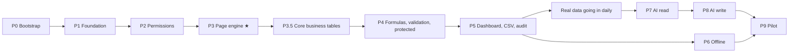

# Velmart — Step-by-Step Implementation Plan

**Derived from:** [PROJECT_PLAN.md](PROJECT_PLAN.md) §26 (roadmap), §24 (testing), §22 (file structure)
**Purpose:** Turn the plan into an ordered, checkable sequence of work with a definition of done at
every step.

- **Total:** ~25 weeks, one developer (≈60% of that with two)
- **The six core tables usable from the end of P3.5** (about week 11)
- **Full data-entry platform from the end of P5** (about week 17)
- **AI from the end of P8** (about week 23)

---

## How to use this document

Work top to bottom. Each phase has **prerequisites**, **numbered steps** naming the files they
touch, **tests to write**, and a **done-when** that is a demonstrable outcome, not "the code is
written".

Two rules that override any schedule pressure:

> **1. P3 is the product.** If the page engine is excellent, everything after it is
> straightforward. If it is mediocre, no amount of AI will rescue it. Budget the full four weeks and
> **do not let it be squeezed.**
>
> **2. Do not start P7 (AI) before P4 and P5 are solid and real data is going in daily.** The AI is
> only as good as the data and schemas underneath it. Building it earlier means debugging two things
> at once, and the AI will get blamed for data problems it did not cause.

---

## Current status

| Item | State |
|---|---|
| Monorepo file structure (§22) | ✅ Scaffolded — all directories and files exist, empty |
| Database schema (§8) | ✅ Implemented — Alembic `0001`–`0007` + SQLAlchemy models |
| Core business tables (§8.9) | ✅ Schema implemented — Alembic `0008` (six tables + reconciliation view) + `app/models/business/`. Service-layer work is P3.5 |
| Documentation (`docs/`) | ✅ Plan (v4.1), architecture, API, runbook, 6 ADRs |
| **Phase 0 — complete (0.1–0.8)** | ✅ Done and **verified against real PostgreSQL 18.6**: full `0001`→`0008` chain applies, reverses to base, and re-applies; `/health/ready` returns 200 as `app_user` |
| Verified live | Generated totals compute and follow updates · negative amounts and direct writes to generated columns rejected · `daily_reconciliation` correct (incl. missing-ledger dates) · audit hash chain links and is append-only for `app_user` · RLS tenant isolation holds |
| **P1 backend — auth (1.4–1.11)** | ✅ Done — money, business dates, Argon2id auth (login/refresh/logout/me), Postgres-backed rate limiting and idempotency, migration `0009`. **81 tests green against real PostgreSQL** |
| `app/services/page_service.py` and onward (P2+) | ⛔ Empty scaffolding |
| **P1 client (1.12–1.17)** | 🟡 All Dart source written — pubspec, Dio client + interceptors, secure storage, `Money` (int minor units), auth repository/controller, login + home screens, go_router guards. **Not yet verified**: no Flutter SDK on this machine, so `flutter pub get` / `dart analyze` / `flutter test` / `flutter create` (platform folders) have not run locally. Reviewed by hand instead — two real bugs found and fixed this way (an invalid `factory` constructor on an enum, and a wrongly-`const` `Uuid()`) — but a hand review is not a substitute for the compiler. `mobile-ci.yml` will run all of this for real (with a genuine Flutter install) on the next push |
| Railway project, CI | ⛔ Not created — P1 |

---

## Working agreement

**Definition of done for any step**

1. Code written and type-checked (`ruff`, `mypy` / `dart analyze` clean).
2. Tests written *and passing* — not "tests to follow".
3. If it mutates data or schema, it writes an audit entry, and a test asserts that.
4. If it is an endpoint, it has a row in the permission matrix, and the matrix suite covers it.
5. Money paths use `Decimal` / `int` minor units. No `float` anywhere near a monetary value.

**Conventions**

- Migrations are hand-authored and touch platform tables plus the six core business tables of
  `0008`. **No migration creates a seventh business table** — that is an Owner-created page.
- No `eval` / `exec`, ever — formulas and validations go through the whitelist parser.
- Column keys are validated against `page_columns` and mapped to safe expressions, never
  interpolated into SQL.
- The permission matrix lives in exactly one file: `app/core/permissions.py`.

---

## Phase 0 — Bootstrap the runnable skeleton

*Not in the original roadmap; it is the gap between "files exist" and "P1 can start".*

| # | Step | Files |
|---|---|---|
| 0.1 | Fill `pyproject.toml` with the full dependency set (FastAPI, Pydantic v2, SQLAlchemy, asyncpg, Alembic, argon2, structlog, boto3, httpx, pytest, testcontainers) and generate `uv.lock` | `apps/api/pyproject.toml`, `uv.lock` |
| 0.2 | `config.py` with pydantic-settings validating **every** env var at boot — a missing secret must crash the container immediately | `app/config.py`, `.env.example` |
| 0.3 | Async engine + session factory; `app_user` for writes, `ai_reader` for AI reads | `app/db/session.py`, `app/db/readonly.py` |
| 0.4 | `SET LOCAL app.company_id / app.role / app.store_ids` helper for RLS | `app/db/rls.py` |
| 0.5 | `main.py` with the app factory, RFC 9457 error handlers, request-id middleware, structlog JSON logging | `app/main.py`, `app/core/errors.py`, `app/core/logging.py` |
| 0.6 | `/health` and `/health/ready` (ready = DB reachable **and** migrations at head) | `app/routers/health.py` |
| 0.7 | Local Docker Compose (Postgres 18 + API) for development | `infra/` |
| 0.8 | **Run `alembic upgrade head` against real Postgres, then `downgrade base`, then up again** | — |

**Done when:** `docker compose up` gives a working API, `/health/ready` returns 200, and the full
migration chain applies and reverses cleanly against a real PostgreSQL 18.

---

## P1 — Foundation · 2 weeks

**Goal:** A user logs in from a phone and a Windows laptop against the live Railway API.

**Prerequisites:** Phase 0.

### Backend

| # | Step | Files |
|---|---|---|
| 1.1 | Multi-stage non-root Dockerfile | `infra/Dockerfile.api`, `apps/api/Dockerfile` |
| 1.2 | Railway project in `asia-southeast1`: `api`, `postgres` (PITR **on**), `bucket`, `cron`. Set the workspace **spend limit** | `infra/railway.json` |
| 1.3 | Migrations as a **pre-deploy** step, never in the start command | `infra/railway.json` |
| 1.4 | Sentry for Python, release-tagged, PII scrubbed | `app/main.py` |
| 1.5 | `money.py` — `Decimal` parsing, half-up rounding to 2dp, defined once | `app/core/money.py` |
| 1.6 | `dates.py` — `business_date` derivation, `day_cutoff_hour`, Asia/Colombo | `app/core/dates.py` |
| 1.7 | `security.py` — Argon2id (m=64MB, t=3, p=4), JWT encode/decode | `app/core/security.py` |
| 1.8 | `POST /auth/login` — lockout after 5 failures, generic 401, audited | `app/routers/auth.py`, `app/services/auth_service.py` |
| 1.9 | `POST /auth/refresh` — rotation, `replaced_by`, **reuse ⇒ revoke the device family** | same |
| 1.10 | `POST /auth/logout`, `GET /me` | `app/routers/auth.py` |
| 1.11 | Postgres-backed idempotency and rate limiting | `app/core/idempotency.py`, `app/core/ratelimit.py` |

### Client

| # | Step | Files | Status |
|---|---|---|---|
| 1.12 | Flutter shell building on **all four targets** | `apps/mobile/` | 🟡 `pubspec.yaml` written; **`flutter create` not yet run** — no platform folders (`ios/`, `android/`, `macos/`, `windows/`, `linux/`) exist yet, so nothing can build to a device or desktop target until that runs |
| 1.13 | Dio client + auth/retry interceptors | `lib/core/network/` | ✅ Written — bearer token attach, single-flight refresh-on-401 with device-family-safe coalescing, exponential-backoff retry gated on `Idempotency-Key` for non-GET |
| 1.14 | Secure token storage (Keychain / Keystore) | `lib/core/storage/secure_store.dart` | ✅ Written |
| 1.15 | `Money` value object backed by `int` minor units — **never `double`** | `lib/core/money/money.dart` | ✅ Written, with a unit test at `test/core/money_test.dart` mirroring `test_money_precision.py` |
| 1.16 | Login screen; display name + role | `lib/features/auth/` | ✅ Written — repository, `AuthState`/`AuthController`, login screen, home screen |
| 1.17 | go_router with role-based guards | `lib/routing/` | ✅ Written — redirect-based guard; **UI convenience only**, mirrors but never replaces the server-side matrix |

**Verification gap, stated plainly:** this machine has Xcode **Command Line Tools** only, not the
full Xcode.app (which needs interactive App Store sign-in to install) — so `flutter run -d macos`
or an iOS simulator cannot be exercised here regardless of platform choice, and there is no Android
SDK either. Every file above was hand-reviewed for balance and against each package's real API
instead of compiler-checked, and that process caught two genuine bugs (a `factory` constructor
declared on an enum — Dart enums cannot have factory constructors — and a `const Uuid()` call, since
`Uuid()` is not a const constructor). A hand review is evidence of care, not a substitute for
`flutter analyze` and `flutter test` actually running. `mobile-ci.yml` installs a real Flutter SDK
on the GitHub Actions runner and will run `pub get` / `analyze` / `test` for real on the next push —
that is the first genuine compile-check this code gets.

### CI

| # | Step | Files |
|---|---|---|
| 1.18 | `api-ci.yml` — ruff, mypy, pytest with testcontainers Postgres | `.github/workflows/` |
| 1.19 | `mobile-ci.yml` — `dart analyze`, `flutter test` | `.github/workflows/` |
| 1.20 | `deploy-production.yml` — main → Railway → healthcheck → smoke test | `.github/workflows/` |

**Tests:** `test_money_precision`, `test_business_dates` (including the midnight/cutoff boundary),
auth flow tests, `conftest.py` with testcontainers Postgres.

**Done when:** a real login works from a phone *and* a Windows laptop against the live Railway API,
and CI is green on `main`.

---

## P2 — Roles and permissions · 2 weeks

**Goal:** A manager token gets 403 on every owner-only endpoint, proven by an exhaustive suite.

**Prerequisites:** P1.

| # | Step | Files |
|---|---|---|
| 2.1 | `SecurityContext` — `company_id`, `user_id`, `role`, `store_ids`, page grants | `app/core/context.py` |
| 2.2 | **The permission matrix from §4.2, in exactly one file** | `app/core/permissions.py` |
| 2.3 | Auth dependency: verify signature, expiry, `token_version`; build the context | `app/dependencies/auth.py` |
| 2.4 | `require_owner`, `require_page_access` guards | `app/dependencies/guards.py` |
| 2.5 | Repository base — **every** query tenant-scoped from the context | `app/repositories/base.py` |
| 2.6 | Wire `SET LOCAL` into the session lifecycle so RLS is always armed | `app/db/rls.py`, `app/dependencies/db.py` |
| 2.7 | User management: create, edit, deactivate, change role (**bumps `token_version`**) | `app/routers/users.py`, `app/services/user_service.py` |
| 2.8 | Store management + `user_stores` assignment | `app/routers/stores.py` |
| 2.9 | Audit service writing through the hash-chain trigger; `PERMISSION_DENIED` on every 403 | `app/services/audit_service.py` |
| 2.10 | Client-side `can.dart` mirroring the matrix — **UI hints only** | `lib/core/permissions/can.dart` |

**Tests (all must be green — this is a release gate):**
`test_permissions_matrix` (parametrised over every role × endpoint; **adding an endpoint without a
matrix row fails CI**), `test_tenancy_isolation` (company A can never read or write company B, at
both the repository and RLS layers).

**Done when:** the permission matrix suite is green and a manager token gets 403 on every owner-only
endpoint.

---

## P3 — Page / table engine · 4 weeks · ★ THE PRODUCT

**Goal:** A non-technical Owner builds a five-column table on a laptop and a manager enters a record
on a phone, with no developer involved.

**Prerequisites:** P2 green. **Do not compress this phase.**

### Schema and validation

| # | Step | Files |
|---|---|---|
| 3.1 | Page service: create/edit, derive `key` from name, uniqueness, archive | `app/services/page_service.py` |
| 3.2 | Column service: all **15 types**, `key` immutability, position/reorder, archive | `app/services/schema_service.py` |
| 3.3 | Projection allocation for indexed NUMBER/CURRENCY/DATE/DATETIME → `projection_map` | `app/services/page_service.py` |
| 3.4 | **Runtime Pydantic model built from `page_columns`** — the heart of validation | `app/schemas/dynamic.py` |
| 3.5 | Schema evolution: widen freely; **narrow via dry-run + explicit confirm**; SELECT option add/remove with in-use warnings | `app/services/schema_service.py` |

### Records

| # | Step | Files |
|---|---|---|
| 3.6 | Record create — validate, derive `business_date`, populate projections, audit | `app/services/record_service.py` |
| 3.7 | Record read / update (Owner only, `If-Match`) / soft delete with reason | same |
| 3.8 | Query service: filters (`eq…is_null`), sort, trigram search — **column keys validated, never interpolated** | `app/services/query_service.py` |
| 3.9 | Aggregation in Postgres over projections: `sum, avg, count, min, max`, `group_by`, periods | same |
| 3.10 | `page_access` grants; default-deny; ungranted pages absent from every response | `app/routers/access.py` |
| 3.11 | Routers: `pages`, `columns`, `records`, `query` | `app/routers/` |

### Client — where most of the value sits

| # | Step | Files |
|---|---|---|
| 3.12 | **One field renderer per column type** | `lib/features/pages/presentation/widgets/field_renderers/` |
| 3.13 | Dynamic form built from the schema | `record_form_screen.dart` |
| 3.14 | Dynamic data table (grid on desktop, cards on mobile) | `record_list_screen.dart` |
| 3.15 | Filter sheet, sort, search | `filter_sheet.dart` |
| 3.16 | Page builder + column editor (Owner only) | `page_builder_screen.dart`, `column_editor_screen.dart` |
| 3.17 | Access editor (Owner grants managers) | `access_editor_screen.dart` |
| 3.18 | Adaptive shell: <600dp bottom nav · 600–1024dp rail · >1024dp sidebar + dense grid | `lib/core/widgets/adaptive_scaffold.dart` |

**Tests:** `test_page_engine`, `test_record_validation`, `test_query_filters` (**injection-proof**),
`test_page_access_grants`, `test_optimistic_locking`.

**Done when:** a non-technical Owner builds a five-column table unaided, and a manager enters a
record on a phone. This is a **usability** gate — watch someone do it; do not assume.

---

## P3.5 — Core business tables · 3 weeks

**Goal:** All six core pages present on first login, behaving exactly like any other page — plus
daily reconciliation, the one workflow the page engine cannot express.

**Prerequisites:** P3. The page engine must exist first — this phase reuses its service layer rather
than duplicating it.

**Already done:** migration `0008_business_tables.py` (six tables, generated totals, CHECK
constraints, the `daily_reconciliation` view, RLS), `BusinessTableMixin` in `app/db/base.py`, the six
models under `app/models/business/`, `SYSTEM_PAGE_KEYS` / `RESERVED_PAGE_KEYS`, and
`pages.is_system` / `storage_table`.

| # | Step | Files |
|---|---|---|
| 3.5.1 | System-page registration: insert the six `pages` rows (`is_system = true`, `storage_table` set) and their `page_columns` — keys, types, display names, `is_protected` on `cheque_status`, `date_column_key` | `app/services/page_service.py` |
| 3.5.2 | Seed on company creation, so a new company has all six from first login | `infra/scripts/seed_demo.py`, `app/services/page_service.py` |
| 3.5.3 | **Reserved keys**: refuse `POST /pages` for `RESERVED_PAGE_KEYS`, including singular/plural variants → 409 `RESERVED_PAGE_KEY` | `app/services/page_service.py` |
| 3.5.4 | **System schemas immutable**: refuse `PATCH`/`DELETE` on a system page and any column edit → 409 `SYSTEM_PAGE_IMMUTABLE` | `app/services/schema_service.py` |
| 3.5.5 | **Storage dispatch** on `pages.storage_table` behind one repository interface | `app/repositories/records.py` |
| 3.5.6 | Map filter/sort/aggregate column keys → real column names via `page_columns`, **never interpolated** | `app/services/query_service.py` |
| 3.5.7 | Write path: `business_date` derivation, optimistic locking, `client_uuid` idempotency, audit — reusing `record_service`, not a parallel one | `app/services/record_service.py` |
| 3.5.8 | Generated columns read-only: reject `total_revenue` / `total_amount` in write bodies, always return them | `app/schemas/dynamic.py` |
| 3.5.9 | Surface DB constraint violations as 422 `VALIDATION_FAILED` with an Owner-facing message | `app/core/errors.py` |
| 3.5.10 | Protected-field endpoint drives `cheques.cheque_status`; manager blocked at create time too | `app/services/protected_field_service.py` |
| 3.5.11 | **Reconciliation service + `GET /reconciliation`** over the `daily_reconciliation` view, date-range filtered | `app/services/dashboard_service.py`, `app/routers/dashboard.py` |
| 3.5.12 | **Reconciliation screen**: Daily Revenue total, Cash Ledger total, Difference per date; zero difference clearly marked as matching | `apps/mobile/lib/features/dashboard/` |
| 3.5.13 | Flutter forms/screens for the six pages via the existing dynamic renderers — no bespoke form code unless a page genuinely needs it | `apps/mobile/lib/features/pages/` |
| 3.5.14 | CSV import/export over native tables through the same generic pipeline | `app/services/csv_service.py` |

**Tests:** `test_reserved_page_keys` (including "Cheque" and "Salary" near-misses),
`test_system_page_immutable`, `test_business_table_constraints` (negative amounts rejected;
`total_revenue` recomputes when `cash_sales` changes; generated columns rejected in write bodies),
`test_reconciliation` (matching totals give zero; a 2,000 discrepancy is reported exactly; a date
with revenue but no ledger entry still appears), and — most importantly — `test_storage_parity`:
the same filter, sort and aggregate assertions run against a **system page** and an **Owner page**
holding matching data, requiring identical results.

**Done when:** a manager enters a purchase and a cheque on a phone, the reconciliation screen shows
a correct difference for a date where revenue and ledger disagree, `POST /pages {name:"Cheque"}`
returns 409, and every query behaves identically across both storage backends.

---

## P4 — Business data and financial workflows · 4 weeks

**Goal:** The Owner builds Expenses, Staff (with a Net Salary formula), and Cheques (with a
protected status), and every calculation matches a hand-worked month.

**Prerequisites:** P3.

| # | Step | Files |
|---|---|---|
| 4.1 | **Safe expression parser** — `ast.parse` + whitelist visitor. Rejects attribute access, imports, calls to non-whitelisted names, comprehensions, lambdas. Depth and length caps | `app/core/expressions/parser.py` |
| 4.2 | Function library: `sum, min, max, round, abs, safe_div, days_between, today, coalesce` | `app/core/expressions/functions.py` |
| 4.3 | `Decimal` evaluator | `app/core/expressions/evaluator.py` |
| 4.4 | Formula columns — computed on read **and** on aggregation, never stored; cycle rejection via a dependency graph at save time | `app/services/formula_service.py` |
| 4.5 | `RECORD_REF` resolution and integrity; block deleting a referenced record | `app/services/reference_service.py` |
| 4.6 | `page_validations`: `ERROR` blocks the save (422), `WARNING` saves + sets `needs_review` | `app/services/validation_service.py` |
| 4.7 | Protected columns: manager gets the default and **cannot override at create time**; Owner-only change endpoint auditing `PROTECTED_FIELD_CHANGE` | `app/services/protected_field_service.py` |
| 4.8 | Ledger pages (`kind = LEDGER`): reversal records, running balance as a window function — **never stored** | `app/services/record_service.py` |
| 4.9 | Review queue for `needs_review` records | `app/services/query_service.py` |
| 4.10 | Client: formula renderer (read-only), protected-field UI respecting `is_protected`, validation editor, review queue screen | `lib/features/pages/` |
| 4.11 | Page-engine hardening at volume — measure with ~100k records | — |

**Tests:** `test_formula_engine` (results match hand-computed `Decimal` across every function;
cycles rejected; parser rejects every dangerous node type), `test_page_validations` (balance rule at,
just under, and just over tolerance), `test_manager_cannot_set_protected_field`,
`test_owner_can_set_protected_field`.

**Done when:** a hand-worked month reconciles **exactly** against the system, including formulas.

---

## P5 — Dashboard, CSV, attachments, audit · 2 weeks

**Goal:** The Owner configures four widgets from their own tables, exports a filtered month, and
every mutation appears in the audit log.

**Prerequisites:** P4.

| # | Step | Files |
|---|---|---|
| 5.1 | Widget config + evaluation: `METRIC`, `TREND`, `BREAKDOWN`, `LIST`, `REVIEW_QUEUE` | `app/services/dashboard_service.py` |
| 5.2 | Inferred starter widgets — **suggestions the Owner accepts or ignores**, never assumptions | same |
| 5.3 | Generic CSV import: encoding/delimiter detection, fuzzy header mapping, **validate every row before writing**, chunked insert (500/txn) | `app/services/csv_service.py`, `app/tasks/csv_import.py` |
| 5.4 | Money normalisation (strip `Rs.`/separators, `(1,234.00)` negative); ambiguous dates **prompt, never guess**; `RECORD_REF` matched on display column | same |
| 5.5 | Batch rollback within 24 hours | `app/services/csv_service.py` |
| 5.6 | CSV export — filtered, UTF-8 **with BOM**, formulas as computed values, **audited** | `app/services/export_service.py` |
| 5.7 | Presigned upload/download, **magic-byte validation**, tenant-prefixed object keys | `app/services/attachment_service.py`, `app/storage/s3_backend.py` |
| 5.8 | Audit read API + Owner-facing plain-sentence view, filterable, exportable | `app/routers/audit.py` |
| 5.9 | Nightly job: chain verify, `pg_dump`, idempotency cleanup, daily digest | `app/tasks/` |
| 5.10 | Client: dashboard with fl_chart, widget builder, import wizard, attachment renderer, audit screen | `lib/features/` |

**Tests:** `test_csv_import` (every bad row caught before writing; rollback removes exactly the
batch), `test_audit_logging` (**every** mutating endpoint produces exactly one entry with correct
old/new values), `test_audit_chain` (tampering is detected), `test_manager_cannot_export`,
`test_manager_cannot_import`.

**Done when:** the platform is genuinely usable day-to-day. **This is the point real data starts
going in** — the shop can begin entering records even though offline and AI are still to come.

---

## P6 — Offline support · 1.5 weeks

**Goal:** A manager creates five records in airplane mode; all five appear exactly once after
reconnecting.

**Prerequisites:** P5, and real daily use underway.

| # | Step | Files |
|---|---|---|
| 6.1 | Drift + SQLCipher cache: records (last 60 days) and page schemas | `lib/core/storage/database.dart` |
| 6.2 | Outbox table with `client_uuid`, payload, attempt count | `lib/core/sync/outbox.dart` |
| 6.3 | Sync engine: FIFO per page, exponential backoff, max 10 attempts | `lib/core/sync/sync_engine.dart` |
| 6.4 | Client-side validation against the **cached** schema (server always re-validates) | `lib/features/pages/` |
| 6.5 | Handle 422 on schema drift — mark FAILED, show the reason **and the current schema** | `lib/core/sync/sync_engine.dart` |
| 6.6 | Pending badges + "3 records not yet synced" banner — **never silent** | `lib/core/widgets/sync_badge.dart` |
| 6.7 | Queued attachment upload on reconnect | `lib/features/attachments/` |
| 6.8 | Clear the encrypted cache on logout | `lib/core/storage/` |

**Tests:** `test_offline_sync_idempotency` (replaying the same `client_uuid` creates **exactly
one** record), plus an integration test for the airplane-mode journey.

**Done when:** five records created offline appear exactly once each after reconnecting, and a
schema change during the offline window produces a clear failure rather than a bad write.

---

## P7 — AI read and analysis · 3 weeks

**Goal:** ≥ 90% correct on **two differently-structured fixture companies**, zero confidently-wrong
numbers.

**Prerequisites:** P4 and P5 solid, **real data going in daily.** Do not start early.

| # | Step | Files |
|---|---|---|
| 7.1 | `ai_reader` role verified: `SELECT` only, 8s statement timeout, no `users`/`refresh_tokens`/`idempotency_keys` | `app/db/readonly.py` |
| 7.2 | Tool registry that **rejects any schema exposing `ctx` fields** | `app/ai/tools/registry.py` |
| 7.3 | Discovery tools: `list_pages`, `get_page_schema`, `get_column_values` | `app/ai/tools/discovery_tools.py` |
| 7.4 | Read tools: `query_records`, `search_records`, `filter_records`, `sort_records`, `aggregate_records`, `calculate_formula` (**same safe parser**) | `app/ai/tools/read_tools.py` |
| 7.5 | `search_entities` over stores, users, and `RECORD_REF` targets | `app/ai/tools/entity_tools.py` |
| 7.6 | Orchestrator: refuses if `ctx.role != OWNER`; budgets of 8 calls / 12s / 2,000 rows / 25k tokens | `app/ai/orchestrator.py` |
| 7.7 | Intent router on a small model | `app/ai/router.py` |
| 7.8 | Prompts: *"you do not know this business; discover it"*; schema block renderer | `app/ai/prompts/` |
| 7.9 | OpenRouter provider + cost tracking, daily cap, kill switch | `app/ai/providers/openrouter.py`, `app/ai/costs.py` |
| 7.10 | Injection defence: data/instruction boundary, pattern detection surfaced as a hygiene note | `app/ai/guardrails.py` |
| 7.11 | Provenance on every figure — page, record count, date range | `app/ai/orchestrator.py` |
| 7.12 | Chat UI with tool-activity chips (**Owner only; absent for managers**) | `lib/features/ai/` |
| 7.13 | **Two fixture companies built through the public API**, with different table names and structures | `tests/factories/pages.py` |
| 7.14 | 50–60 golden questions: 20 simple, 15 multi-page, 10 ambiguous, 10 out-of-scope, 5 adversarial | `tests/ai/test_golden_questions.py` |

**Tests:** `test_tool_schemas` (**no `ctx` fields** — fails the build), `test_schema_discovery`,
`test_injection_defence`, `test_manager_cannot_access_ai`, `test_golden_questions`.

**Done when:** ≥ 90% on **both** fixtures with **zero confidently-wrong numbers**. Passing one
fixture and failing the other means something was hard-coded that should not have been.

---

## P8 — AI proposed updates · 2 weeks

**Goal:** 50 supervised proposals applied with zero unintended changes.

**Prerequisites:** P7 gate passed.

| # | Step | Files |
|---|---|---|
| 8.1 | Propose tools — **create proposals only, never write** | `app/ai/tools/propose_tools.py` |
| 8.2 | Server-side resolution: exactly one record, or return a disambiguation list. **Never pick** | `app/ai/proposals.py` |
| 8.3 | Server computes `before_data` / `after_data` from the database | same |
| 8.4 | Validate against schema, types, options, references, and the Owner's rules | same |
| 8.5 | **Recalculate formula columns** so the diff shows downstream effects | same |
| 8.6 | Persist with `PENDING`, 10-minute TTL, `expected_version` per item | same |
| 8.7 | Apply endpoint: re-validate, check versions, one transaction, audit `source = 'AI'` | `app/routers/ai.py` |
| 8.8 | Cancel + expiry handling | same |
| 8.9 | Blast radius: cap 20 items; >5 records renders per-item checkboxes and a bulk warning | `app/ai/guardrails.py` |
| 8.10 | Proposal card with the **UPDATE** button | `lib/features/ai/presentation/widgets/proposal_card.dart` |

**Tests:** `test_proposal_flow`, `test_proposal_stale_version` (409, **optimistic locking**),
expired proposal returns 409 and changes nothing, cannot be applied twice, cancelling leaves data
untouched, `before_data` matches the **database** not the model's claim, and no tool can mutate the
database directly (asserted against the registry).

**Done when:** 50 supervised proposals applied with zero unintended changes.

---

## P9 — Supermarket pilot · 2 weeks

**Goal:** Two weeks running in parallel with the spreadsheets, reconciled to zero.

**Bug and UX fixes only — no new features.**

| # | Step |
|---|---|
| 9.1 | **Half-day onboarding**: sit with the Owner, look at the existing spreadsheets, build the first four or five tables together. This is training, and it belongs in the plan |
| 9.2 | Hand over the page builder; the Owner builds the next table unaided |
| 9.3 | Manager training; one-page printed cheat sheet each |
| 9.4 | Review page-access grants — the manager sees exactly what they should |
| 9.5 | Run in parallel with the spreadsheets; reconcile daily |
| 9.6 | Daily feedback → fix → redeploy |
| 9.7 | Complete the **restore drill**, record the time in [RUNBOOK.md](RUNBOOK.md) §5 |
| 9.8 | Verify p95 < 400 ms from a Colombo connection |
| 9.9 | Write the fallback plan: how to run on spreadsheets for a day |

**Done when:** two weeks with **zero data discrepancies** against the spreadsheets.

---

## Critical path

**Sequencing rules**

1. Nothing starts before P2 is green — permissions are the foundation everything else assumes.
2. P3 gets its full four weeks.
3. P7 waits for real data, not just working code.
4. P6 (offline) can run in parallel with P7 if a second developer exists; it is not on the AI path.

---

## Release gates

Copied from §3.2 — these are the contract, not aspirations.

### Before the shop goes live

- [ ] Permission matrix suite green; every manager-denial test green
- [ ] Page access grant tests green
- [ ] Tenancy isolation suite green
- [ ] Formula engine, validation rules, money precision, and business-date tests green
- [ ] Filter and sort injection tests green
- [ ] **A non-technical Owner has built a real table unaided and entered records into it**
- [ ] The Owner's first four or five tables built and populated with opening data
- [ ] Restore drill completed — **rows *and* page schemas verified** — and the time recorded
- [ ] PITR confirmed enabled on production Postgres
- [ ] Spend limit set on the Railway workspace
- [ ] Sentry receiving events from the API and all four client builds
- [ ] Uptime monitor active on `/health`
- [ ] p95 < 400 ms verified from a Colombo connection
- [ ] All secrets in Railway variables; repository scanned for accidental commits
- [ ] Owner and manager trained, each with a one-page printed cheat sheet
- [ ] Page access grants reviewed
- [ ] Two weeks of parallel running, reconciled to zero
- [ ] Data export tested — the Owner can get everything out without help
- [ ] Rollback plan written

### Before AI is switched on

- [ ] Golden-question evals ≥ 90% on **two differently-structured fixture companies**
- [ ] **Zero confidently-wrong numbers** in the eval run
- [ ] Injection tests pass with adversarial strings planted in record text
- [ ] Read tools verified running on the `ai_reader` role
- [ ] No tool schema exposes `company_id`, `user_id`, or `role` (CI lint green)
- [ ] Manager tokens verified to get 403 on every `/ai/*` endpoint
- [ ] Proposal expiry, version checking, and cancellation manually verified
- [ ] Daily spend cap set and tested by **deliberately hitting it**
- [ ] 50 supervised proposals applied with zero unintended changes
- [ ] Owner briefed: **the AI can be wrong** — check the underlying records for anything material

---

## Coverage targets

| Layer | Target |
|---|---|
| `core/expressions/`, `core/money.py`, `core/dates.py` | 95% |
| Page engine services (`record_service`, `page_service`, `validation_service`) | 90% |
| Other services | 85% |
| Repositories (integration) | 80% |
| **Permission matrix** | **100% of endpoints** |
| **Tenancy + page access** | **100%** |
| Flutter unit | 70% |
| Flutter integration | 3 journeys (owner builds a table, manager entry, owner AI proposal) |

---

## Progress tracker

| Phase | Weeks | Status | Gate |
|---|---|---|---|
| P0 Bootstrap | — | ⬜ Not started | Migrations verified on real Postgres |
| P1 Foundation | 2 | ⬜ Not started | Login works from phone + laptop against Railway |
| P2 Permissions | 2 | ⬜ Not started | Matrix suite green |
| P3 Page engine ★ | 4 | ⬜ Not started | Owner builds a table unaided |
| P3.5 Core business tables | 3 | 🟡 Schema done | Storage parity, reserved keys, reconciliation green |
| P4 Financial workflows | 4 | ⬜ Not started | Hand-worked month reconciles exactly |
| P5 Dashboard/CSV/audit | 2 | ⬜ Not started | Four widgets, filtered export, full audit |
| P6 Offline | 1.5 | ⬜ Not started | Five offline records appear exactly once |
| P7 AI read | 3 | ⬜ Not started | ≥90% on two fixtures, zero wrong numbers |
| P8 AI write | 2 | ⬜ Not started | 50 proposals, zero unintended changes |
| P9 Pilot | 2 | ⬜ Not started | Two weeks reconciled to zero |

*Update this table as phases complete. It is the fastest answer to "where are we?"*
